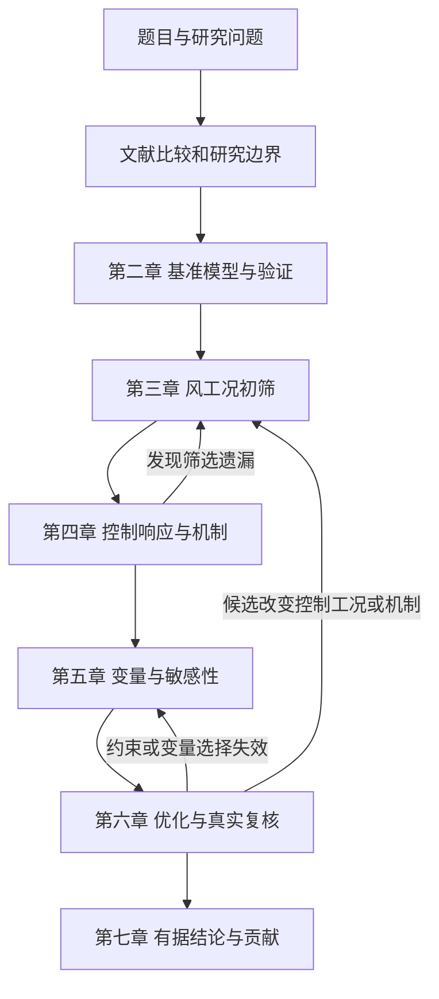

# 整篇论文研究流程审查与修正

日期：2026-10-04。按用户最新要求，当前只审查整篇研究流程，撤销旧Simpack及双向桥接路线，保留当前OpenFAST→Abaqus载荷映射验证；数据文件与求解专项核查暂缓。正文没有改写，结果与创新没有提前认定完成。来源是本次原稿结构、老师问题归纳及已读文献。

本记录补充[既有结构审计](18-literature-driven-thesis-structure-audit.md)，不替代[唯一MASTER](../workflow/MASTER_RESEARCH_PROTOCOL.md)。正式任务T023，检查项另见[40项逐章映射](28-chapter-checklist.md)。导师问题编号沿用[REQ台账](../requirements/advisor_requirement_matrix.tsv)。

## 明确判定

**七章总体顺序可行，工作题目《10 MW级陆上风机预应力混凝土—钢混合塔架抗风性能与结构优化研究》可条件性保留。现有流程还不能直接支撑一篇完成的大论文，主要问题是六处章间衔接缺乏明确产物与判定规则。**这项流程审查现在可以完成，无须先取得全部仿真结果。

当前MASTER已按导师要求收束范围。本轮确认研究范围为10 MW参考机组与158 m预应力混合塔的运行风致性能及机制驱动优化。实际场址背景、参考研究组合和设计认证分别说明。风震连续作用、另建软件接口和完整全寿命可靠度不作为当前主线的必选任务；若未来保留，须论证其对核心问题的必要性。

## 研究问题与现有台账对应

正式编号沿用[研究问题台账Q01–Q05](../registry/research_questions.tsv)，与既有结构审计保持一致：

| 研究问题 | 对应章节 | 本轮检查的章间关系 |
| --- | --- | --- |
| Q01 模型身份和可信性 | 第二章 | 为后续解释提供已验证能力及限制 |
| Q02 控制风况 | 第三章 | 初筛并给出有依据、守恒映射的结构输入 |
| Q03 控制部位与机制 | 第四章 | 解释哪里、为何、何时控制，形成变量假设 |
| Q04 工程变量与敏感性 | 第五章 | 检验机制假设、交互和随机性，筛减变量 |
| Q05 优化与独立复核 | 第六章 | 真实复算候选并检查新的控制工况 |

它们共同回答两项总目标：控制风致响应的机制是什么；如何据此形成有工程依据并经独立复核的改进方案。模型复现、软件和算法是证明工具。若最终只有模型复现，题目中的“结构优化”需重审；工作题目不等于成果已经完成。

## 六处断点及修正

| 编号 | 对应老师问题 | 当前流程风险 | 需要落实的修正 | 如何判断修正有效 |
| --- | --- | --- | --- | --- |
| F01 目标不聚焦 | REQ001、REQ002、REQ004、REQ012、REQ013、REQ014、REQ015 | 位移、应力、DEL、质量、成本和经济性并列，缺少主次 | 沿用原稿材料质量与主控响应的目标方向；先定义主控响应。强度、变形、动力及必要疲劳作为有据的约束；若转向成本或LCOE，另建对应口径 | 每个目标说明工程意义和单位；约束不被随意替代，质量降低不冒称LCOE降低 |
| F02 验证范围与解释范围不对应 | REQ007、REQ008、REQ009、REQ010 | 频率接近被扩大为整个模型、非线性和接缝可靠 | 第二章按后续关注指标分别验证整体动力、初态、非线性及相关局部能力，列清可以/不能解释什么 | 第四章每项物理解释对应模型能力及相应验证；整体频率不替代局部接触验证 |
| F03 初筛不能保证最终控制 | REQ003、REQ004、REQ011、REQ017 | 第三章按塔底载荷或DEL筛选后，默认能控制所有局部结构指标 | 第三章多指标初筛；第四章按结构响应复核。新发现局部控制机制时回补相关工况 | 筛选理由公开，遗漏和回补有记录；基线和候选方案的控制工况分别检查 |
| F04 结果罗列不能代替机制 | REQ003、REQ004、REQ017 | 位移、PSD、应力云图存在，但“哪里控制、为何控制、何时控制”不清 | 第四章围绕关键位置、受力分组、非线性贡献和事件组织结果；设置相同初态的受控对照 | 机制由评价准则与对照支持，而非单幅云图或文献已有结论 |
| F05 优化变量先选后解释 | REQ003、REQ004、REQ016、REQ017 | 直接选壁厚、材料、预应力，再寻找理由 | 第四章产出机制—变量假设；第五章检验敏感性、交互、稳定性与工程可调整性后筛选 | 每个保留/剔除变量都能回溯机制与范围来源；局部趋势不冒称全局排序 |
| F06 算法输出不能证明方案有效 | REQ004、REQ010、REQ017 | 代理预测/Pareto搜索被写为已获得可靠最优方案 | 独立样本检验代理，真实分析复核候选；同口径与基准比较，并重查候选控制工况 | 真实收益、约束余量与不确定性可解释；候选未通过时如实保留，不能只展示漂亮前沿 |

## 修正后的七章职责

| 章节 | 输入 | 核心分析 | 必须输出给下一章的内容 | 流程验收 |
| --- | --- | --- | --- | --- |
| 第一章 绪论 | 工程需求、老师问题、已读原文 | 比较研究对象、方法能力、验证与边界，明确Q01–Q05 | 范围、文献差距、研究问题、技术路线、待检验贡献 | Q01–Q05分别由第二至六章回答；软件和算法不单独作为创新 |
| 第二章 基准模型与验证 | 来源参数、构造假设及研究所需能力 | 基准模型、RNA简化、初态、数值可靠性与相关非线性验证 | 固定基准、通过的能力、尚有限制的指标及误差 | 所用结果有相应验证；不把整体动态吻合扩大到接缝局部真实性 |
| 第三章 风输入与工况初筛 | 基准、风资源和作用定义 | 处理风况、定义工况、说明气动/结构反馈能力并初筛 | 工况矩阵、代表集合、筛选指标/理由、未覆盖范围 | 风速身份、窗口、载荷通道统一；历史高风不改称重现期设计风 |
| 第四章 风致响应与控制机制 | 代表工况及模型验证边界 | 响应统计、频域、非线性分解与截面传力；必要时回补工况 | 控制工况、控制部位、机制依据、变量和约束候选 | “薄弱”有标准；只解释实际模型能够表示的机制；结尾形成变量假设 |
| 第五章 机制驱动参数筛选 | 机制、候选变量及工程范围 | 参数化、敏感性/交互、工况及随机实现下的稳定性 | 正式变量、范围、主要关系及筛减理由 | 变量源于第四章；说明方法是局部还是全局，及其排序适用范围 |
| 第六章 优化与方案复核 | 正式变量、目标/约束及有效样本 | 优化、代理独立检验、候选真实复算及控制工况重检 | 可行候选、收益、约束余量、稳健性与工程解释 | 真实复算而非代理预测证明方案；控制工况变化时返回第三/四章 |
| 第七章 结论与贡献 | 第二至六章已通过证据 | 回答Q01–Q05，与已有研究比较并限定范围 | 逐条有据的结论、成立的贡献、限制与后续工作 | 不引入新结果；摘要与正文状态一致，计划不写成成果 |

## 必须保留的回路

第二、三章还须说明是否考虑结构运动对气动载荷和控制状态的反馈。若采用预先生成载荷，应准确称外部载荷下的结构响应；若包含反馈，其作用与数值可靠性另行验证。流程根据问题需要选择能力，不以建立指定软件链作为研究目标。

候选若改变质量、刚度、模态、阻尼或控制相关响应，应复查整机载荷模型对候选的代表性；必要时更新并重算相关整机工况，再映射至精细塔架。不能默认所有候选都可使用固定基线载荷证明改进；若采用冻结载荷方案，须限定反馈误差与适用范围。

非线性对照须保持同一质量、重力、可比预应力平衡初态、风况和阻尼设置，逐因素改变；若故意改变初态，另列其贡献，不能全部归于材料非线性。

疲劳设置两级：载荷雨流/DEL用于相同定义下的比较；材料寿命另需应力恢复、材料关系及工况权重。后一级不能完成时，仍可进行限定范围的抗风与载荷比较，但不能宣称全寿命可靠或已满足疲劳设计。

## 现在先完成的流程产物

1. 用Q01–Q05统一题目、各章职责和结论回收。已在本记录形成映射。
2. 由第四章的预期机制产物反推第五章变量假设，明确保留/剔除规则。已在40项清单C04-07、C05-01—04落位，重要变量尚不提前判定。
3. 明确第三章是初筛、第四章及优化候选要复检工况。已补流程回路。
4. 明确目标、约束和候选复核三者分工。已在C06-01—04落位，数值阈值和目标公式留待依据核查。
5. [40项清单](28-chapter-checklist.md)作为T023补充检查映射；后续具体文献、模型、数据与计算验证仍由MASTER和正式任务台账安排。当前这些输入缺口不作为停止流程审查的理由。

流程层面已形成可执行的修正方案；研究问题是否被回答、优化是否有效、创新是否成立仍须后续证据判定。
