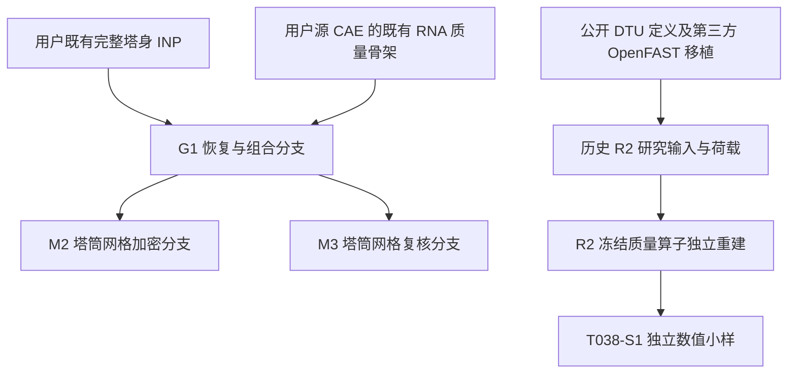

# 现用风机与塔架模型逐项说明：来源、真实实现、验证范围与缺口

日期：2026-10-05。任务：T038-S2。状态：**模型实现核查与公开记录；物理适用性仍未全部验收。** 本次只读检查现有文件，不修改模型、不提交新求解、不把待实施项写成已完成。

本轮核查起点为仓库提交 `17723adc4b29948837e4246603ec9a8f5007e372`。G1/M2/M3 本机 INP 的 Git blob 与该提交逐一相同；既有 INP、DAT、ODB 的 SHA256 也与已公开结果记录一致。完整记录见 [GitHub与本机文件身份](github-evidence-index.json) 和 [已有求解证据摘要](historical-run-evidence-summary.json)。

## 1. 先回答：用的是谁的模型，RNA 到底做到了什么

**当前 M2 是在用户既有模型资产上恢复、组合、加密形成的研究分支。** 塔身母本是用户已有 `DTU158_MODAL_CHECK.inp`；RNA 的 28 个质量载体梁来自用户源 CAE 中已有、曾被抑制的骨架，经副本恢复后接入。G1 继承历史INP的67个非RNA Part：35段塔身、31组纵筋、1个PT Part；M2/M3进一步替换35个塔身Part的网格。原CAE的CSEG_01为空；M2/M3所用原生网格族中，该段按历史完整INP截面与高度重建，其余34段复制源原生几何。完整继承和变更链见 [模型来源逐文件审查](model-provenance-review.md)。这不是将原 CAE 原封不动提交，也不能称为 DTU 官方完整 158 m 混塔模型。

|对象|当前实际是什么|已经做到|尚未做到|
|---|---|---|---|
|公开参考机组|DTU 10 MW；官方报告、HAWC2及第三方OpenFAST移植须分别标识|公开来源及机读参数有记录|不能把本研究158 m混塔称为DTU官方原塔|
|历史用户CAE的RNA|已有外形网格和质量骨架；不同历史模型/抑制状态分别保留|可追溯到源文件与导出记录|有外形网格不等于已有合格的柔性结构模型；旧审查发现过壳单元与截面不匹配、过强刚性耦合|
|当前M2中的RNA|28个B31梁承载等效质量，整体 `Rigid Body`；RP=(0,160,0) m|既有实际整塔重力、模态、小幅柔度计算使用这一分支|没有叶片复合铺层、可变形机舱/轮毂实体、真实旋转或气弹反馈|
|T038-S1新RNA小样|质心MASS＋完整ROTARYI＋偏心六自由度耦合；目标来自R2未变形锁定状态的独立重建|实际运行质量矩阵、重力、规定运动动能核验；5次求解、最终3类检查通过|小样没有塔架，尚未替换M2中的28梁RNA；不代表柔性旋转RNA已验证|
|OpenFAST R2|DTU第三方移植＋158 m研究塔卡＋本地控制/阻尼配置；历史运行3.5.3与ROSCO2.6.0|输入归档及历史36工况来源已有核查|本次没有重跑；原本地可运行目录尚未在本步恢复；不能把已有荷载和新小样视为已经统一验收|

M2 RNA 质量为 **673998.493138 kg**；R2冻结目标为 **676753.290723 kg**。二者相差约 **2754.797585 kg**，质心与惯量也不能自动视为相同。新小样通过只证明指定R2冻结质量算子的Abaqus实现，不会自动改变旧整塔输入或旧风荷载。

图中两条链没有画成已经合并：S1尚未接入M2，整塔RNA与载荷自由体的对应仍待闭合。

## 2. 正在核查的精确文件

- 主文件：`D:/Codex-research-validation/T026/tower/DTU158_RECONSTRUCTED_M2/DTU158_RECONSTRUCTED_M2.inp`。
- SHA256：`428a8bb567a52200311ebb1a2019a71c304d1c427ce761f0c836e4fc46fe50f1`。
- [GitHub对应原始INP](https://github.com/g2066203208-beep/voxel-frontier/blob/17723adc4b29948837e4246603ec9a8f5007e372/research/wind-tower/experiments/T026/inputs/RUN-T026-034/DTU158_RECONSTRUCTED_M2.inp)。本目录各专项报告提供关键词行号。
- 单位为m–kg–s–N–Pa，Abaqus全局+Y向上；重力沿−Y。Part局部坐标要加Instance平移才能得到全局标高。
- 中间恢复CAE的当前hash与最早恢复保存记录不同，但与随后实际网格生成报告中的源CAE hash一致；变化原因未查明。最终导出INP、G1/M2/M3身份已核对，不能据此宣称所有中间文件从未变化。

## 3. 塔筒几何、实体单元与网格

几何沿用何泽瑜（2024）公开学位论文及用户历史输入：总高158 m，混凝土112 m/31段，钢塔46 m/4段。DTU原参考塔顶约115.63 m、轮毂119 m属于另一参考几何。R2配158 m塔后按其真实偏置计算轮毂约161.368806 m；M2的160 m只是当前RNA参考点标高，不能混写成已一致的轮毂高度。

|构件|实际单元|数量|实际划分|
|---|---|---:|---|
|31段混凝土塔筒|C3D8R，8节点减缩积分实体|13392|每段72周向×3轴向×2厚度=432个；不是壳模型|
|4段钢塔筒|C3D8I，8节点非协调模式实体|1728|每段36周向×6轴向×2厚度=432个；不是壳模型|
|31组普通纵筋|T3D2桁架|5440|各段内外两排，逐根、逐段建；不是全高连续的一根单元|
|预应力筋|T3D2桁架|36|每根以一个贯通112 m的单元表示|
|RNA质量骨架|B31梁|28|12个轮毂圈单元＋15个叶片分段单元＋1个机舱载质量单元；整体刚体|
|混凝土水平接缝|SPRING2|180|30个界面×6个自由度弹簧|

合计 **68个Part/68个Instance、40854个用户定义节点、20804个输入单元**；节点中包含装配层62个参考节点。DAT另报求解器总节点49550、总单元20805；用户定义与求解器内部生成量须分开。15120只是塔筒实体单元小计，不是全模型单元总数。

混凝土底外径8.33 m、顶外径4.97 m；壁厚和直径逐段变化。31段中第20段3.62 m、第21段3.66 m、末段2.8 m，不能全部写成3.64 m。钢段各11.5 m，四段顶部外径4.66/4.58/4.50/4.42 m、顶部壁厚38/37/36/35 mm。完整逐段上下标高、直径、厚度、节点与单元统计见 [35段几何网格CSV](tower-segment-geometry-mesh.csv) 与 [网格专项报告](mesh-geometry-review.md)。

**必须披露的几何假设：**何泽瑜表3-3表头写“半径”，而当前输入将4.66等值按直径实现；这是已知的来源语义冲突，不能断言原文必然笔误。塔底8.33 m、钢段底39 mm等重建值也需要保留其推定/待核来源，不能都称为表格直接给定。

## 4. 普通钢筋和预应力筋

|事项|真实实现|不能据此宣称|
|---|---|---|
|普通纵筋数量|分31段，内外排每排根数随高度108→76；合计5440个段内桁架单元|不能把分段根数相加当成塔底同时有5440根贯通钢筋|
|普通纵筋截面|面积0.000490874 m²，约等于直径25 mm圆筋|25 mm构造来源尚待更直接依据|
|实际纵筋材料|31组截面均引用S345，与钢塔共用该材料卡|卡片中存在但未被截面引用的HRB500_BASELINE不等于已采用HRB500；也不能写成Xu文中的HRB335|
|钢筋—混凝土|31处Embedded约束，按段嵌入相应混凝土宿主|没有钢筋粘结滑移、拔出或独立界面损伤模型|
|环向钢筋/箍筋|当前M2未发现独立环向钢筋Part或相应有效钢筋层定义|不能称已经建立完整双向钢筋网|
|预应力筋|36根、金属面积140 mm²/根；材料E=195 GPa、ρ=7850 kg/m³|根数36的原始构造依据仍待核；15.2 mm钢绞线不能直接用圆截面πd²/4替代金属面积|
|预应力施加|初始应力1280 MPa，底端3平移固定，顶部用约束方程联系法兰RP平移及转动|这不是张拉全过程、锚具实体、锚固滑移或损失全过程模型|
|PT沿程关系|无沿程Embedded、孔道接触或中间导向定义；每根一个112 m直桁架|不能宣称已模拟筋—孔道摩擦、横向支承、屈服和断裂|

纵筋跨混凝土段接缝没有直接共节点或跨缝钢筋连接单元。即使两端几何位置吻合，也仍是两个独立实例节点；传力依赖各段Embedded宿主及混凝土端面等效弹簧。改变每圈根数的J04/J11/J15/J20界面还存在仅部分端点几何对应。必须在论文中明示这种连续性简化。

完整材料曲线、31段纵筋分配、PT约束方程与行号见 [材料、钢筋与连接专项报告](reinforcement-material-contact-review.md) 和同名JSON。

## 5. 混凝土及钢材本构

|材料|赋予对象|当前有效输入|
|---|---|---|
|C70|混凝土第1–2段|E=37 GPa、ν=0.2、ρ=2400 kg/m³；压缩峰值44.5 MPa、拉伸起始2.99 MPa|
|C65|混凝土第3–31段|E=36.5 GPa、ν=0.2、ρ=2400 kg/m³；压缩峰值41.5 MPa、拉伸起始2.93 MPa|
|两种混凝土CDP|上述混凝土实体|膨胀角30°、偏心率0.1、fb0/fc0=1.16、K=0.666667、黏性1e−5；有压/拉应力表与损伤表|
|S345|钢塔及普通纵筋|E=200 GPa、ν=0.3、ρ=7800 kg/m³；塑性应力点345/365/420 MPa及对应塑性应变见原卡|
|PT|预应力筋|弹性材料；E=195 GPa；当前没有筋材塑性/损伤定义|
|RNA等效材料|28个质量承载梁|人工等效密度分区服务于质量表示；不能视为机舱壳体或叶片复合材料真实密度|

C65/C70的部分E和强度与Xu等文献一致；这不等于全套CDP曲线、多轴参数、软化和网格正则化均已获验证。当前黏性为1e−5，不能抄旧表中的0。现有单材料小样检查也不能升级为塔体开裂、峰后响应或疲劳本构已通过。

## 6. 接触、连接与边界：有与没有分别写明

|连接位置|当前实际关键词/拓扑|物理简化及缺口|
|---|---|---|
|30个混凝土段间水平界面|端面Kinematic约束到各自RP，再由6自由度SPRING2连接|等效线性刚度连接；没有开闭、脱开、法向硬接触、摩擦滑移或接触压力计算|
|界面平移/扭转刚度|DOF1/2/3均1e14 N/m；DOF5为1e14 N·m/rad|这些高刚度值的物理标定尚未闭合|
|界面两向弯曲刚度|DOF4/6约8.75565e11–2.91321e12 N·m/rad，逐界面不同|逐项值、关联节点及行号见专项JSON；不能仅凭结果相近证明刚度真实|
|混凝土顶与第一钢段|Tie_C31_S01|完全绑定的全局等效连接，无独立过渡法兰/螺栓/灌浆接触模型|
|4钢段之间|3处Tie|没有焊缝细节、焊趾网格、连接螺栓疲劳或接触滑移|
|塔底|混凝土底面ENCASTRE；PT底另固定|固定基底研究边界，没有基础实体/土体/桩土耦合|
|塔顶与RNA|SSEG_04顶面耦合到同一个RP=(0,160,0) m，RNA骨架整体Rigid Body；没有独立158 m RNA参考节点|保留2 m刚性偏置和刚体惯性传递；没有内部柔性自由度|

本次检查不把 `*SURFACE`、`*TIE` 或 `*COUPLING` 的存在当作接触已建立。实际接触卡片、摩擦属性、接触开闭输出及局部构造仍应按各自证据检查。

另有非结构质量：混凝土区4622.69+33004.8 kg、钢区2172.73 kg，合计39800.22 kg。它们已进入当前模型，但各物理分项来源仍需核实；不能在后续替换RNA时重复计入。

## 7. 已经运行的内容与真实警告

当前M2实际包含 **Gravity非线性几何静力基态、Modal频率提取、Flex_X/Flex_Z各1 kN小幅线性扰动**。本次重新核对了对应文件hash；这里引用的是既有T026结果，不是本次新仿真。

完整M2输入未发现 `*DAMPING`、`*MODAL DAMPING` 或 `*DYNAMIC` 卡片。当前这份静力/模态输入不能证明已实施生产时程的结构阻尼。CDP黏性1e−5服务于材料数值实施，不能把它当作OpenFAST的模态阻尼比或已经标定的Rayleigh阻尼。

|已有结果|实际证据与范围|
|---|---|
|M2整模质量|约2601434.479595 kg；包括塔体、钢筋/PT、RNA及已赋非结构质量|
|M2前四频率|0.13521、0.13576、0.70795、0.74291 Hz；为当前刚体RNA、固定底、指定基态和连接假设下结果|
|M2预应力平衡后S11|约1259.708–1263.520 MPa；1280 MPa只是输入初应力|
|G1/M2/M3既有网格对照|M2→M3前四频率变化约0.0452%–0.1704%，两向1 kN柔度约0.3007%，满足当时登记的0.5%全局指标预算|
|重力合力/力矩平衡|已有三档检查通过；本次只核证据身份|
|重力末态混凝土损伤为零|仅说明该基态下输出损伤变量为零，不代表工作风况、极限状态或疲劳不会损伤|

**M2并非零警告：DAT记录12条警告，其中1512个单元长宽比超过100。** 本轮几何检查也显示钢实体厚度单元约17.5–19.5 mm，而轴向约1.917 m。必须保留这项网格风险，不能用低阶频率和全局柔度已收敛代替局部应力、开裂、接触、焊缝或疲劳热点的网格验收。其余警告及确切行号见材料/连接报告。

上一轮“5次求解均零警告”的说法专指T038-S1的5个独立小样，不适用于T026的M2整塔。

## 8. OpenFAST与Abaqus的对应仍需单独审定

R2采用ElastoDyn模态降阶叶片/塔架与气动、控制模块；`TwrNodes=1120`是其结构积分节点，塔卡70个分布属性站，不是本表中的实体有限元网格。历史AeroDyn `TwrAero=False`，因此不能直接说R2已经包含塔身分布风载；后续如何给Abaqus施加塔身风载必须明确。

R2历史实际运行版本3.5.3和ROSCO2.6.0、塔阻尼约4.63%/5.53%、实际轮毂高度及原本地绝对路径等，见此前 [T037来源审定](../../../audit/41-t037-baseline-source-review.md) 以及 [T038 RNA身份审查](../README.md)。本轮不将模板标题3.3.0误认为实际求解版本，也不把RNA小样的质量核验说成上述动力学问题已闭合。

接入整塔前仍需明确塔顶载荷自由体：截面内力若已经包含RNA惯性/重力，不能再重复叠加同一作用。这项边界必须与最终采用的RNA模型和荷载输出通道共同记录。

## 9. 参考文献和方法依据的真实持有情况

|来源|本模型中用途|本次披露范围|
|---|---|---|
|何泽瑜，2024，《大型混塔式风力机的建模与可靠度分析》|158 m混塔、31+4分段及几何原型|本机完整90页PDF，本轮核读PDF33–35页；本次补入GitHub参考目录并登记SHA256。表3-3语义冲突继续保留|
|Bak等，DTU Report-I-0092，2013|公开10 MW参考机组定义|仓库采用Git LFS；本轮已验证实际对象可访问、PDF文件头及10,815,847字节总长，未冒称新做全文审读|
|Xu等，Renewable Energy 243 (2025), 122475|同类混塔方法与部分材料参数对照|仓库完整PDF存在；不同钢筋牌号、钢材E与RNA数值不能混为当前实际输入|
|Cheng等，Structures 68 (2024), 107235|质量、偏心、惯量及参考点耦合的方法先例|前一步已实读相关页；支持建模思路，不提供本小样参数及验收预算|
|Abaqus官方定义|MASS、ROTARYI、KINEMATIC、矩阵生成、重力及动能输出的语义|前一步逐项官方核对记录继续保留；软件定义本身不能替代连接刚度、配筋和材料物理标定|

文献位置、文件身份与新增何泽瑜原文记录见 [参考源清单](reference-sources.json)；DTU LFS可访问性见 [读取记录](reference-lfs-accessibility.json)。何泽瑜原文是用户提供的参考学位论文，不是用户正在写的大论文。

## 10. 本次交付与后续每次变更如何记

- [来源与继承链](model-provenance-review.md)：每个母本、恢复分支、网格分支的真实路径、hash及变化。
- [几何、网格与单元](mesh-geometry-review.md)：各Part/Instance、数量、网格层数、真实节点尺寸、行号和限制；另有35段CSV。
- [材料、钢筋、预应力、连接](reinforcement-material-contact-review.md)：完整材料数据、截面分配、约束/连接、边界与步骤、警告；另有可机器读取JSON。
- [逐构件状态表](model-component-register.tsv)：实现、证据、已验内容、待验内容并列。
- 本目录解析脚本可重复读取原文件；运行后只写审查数据，不修改原模型、不调用求解器。

后续模型每次变更都应新增版本记录：改了哪个构件及参数、文献/规范依据、旧/新文件hash、影响哪些载荷与结果、实际提交的作业、成功和失败日志、验收指标以及仍未完成的部分。任何新增图形、卡片或章节文字都不能替代实际求解证据。

**本次结论：模型细节已经逐项公开，当前M2仍是有明确简化和待验项目的结构候选。RNA详细柔性/旋转适用性、真实局部接触、局部应力网格与疲劳输入尚未由本次审计关闭。**
