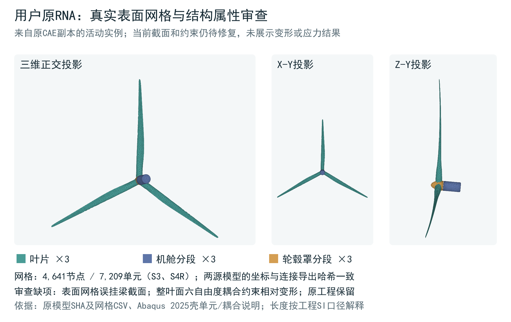

# T038-S3：用户源 CAE 中的 RNA、旋转分支与环筋实际核对

2026-10-05｜源文件审查已完成；结构修正及运行适用性未验收。

**有：用户已经建立 RNA 外形与网格，源 CAE 中确实存在 `RNA_REAL_EXPLICIT` 显式旋转分支。用户也已经建立并网格化环向钢筋。不能把当前 M2 采用简化质量骨架，解释成用户从未建立 RNA 或环筋。**

本次在用户电脑上以 Abaqus 原生接口读取 3 份源 CAE 的全部 5 个模型条目，进一步展开截面分配区域、铺层、节点耦合、实例抑制状态和旋转边界。结论基于实际对象及节点/单元标签核对，不按文件名或截图推断。原件与读取副本前后 SHA256 一致。没有创建或提交 Job，没有生成新 INP，没有保存 CAE；本次不是一次仿真。以下问题说明现有模型仍需修正，不能据此否认用户已有的建模工作。

## 1. 实际读取了哪些文件

|源文件|原生读取的模型|RNA 外形状态|
|---|---|---|
|`D:/MC/SIMPACK_SITE_ONLY.cae`|`DTU158_SITE_S04_INTERFACE_DYNAMIC`|9 个活动外形实例，4641 节点、7209 壳单元|
|同上|`RNA_REAL_EXPLICIT`|相同外形网格；另有显式旋转步与角速度边界|
|`D:/MC/DTU158_MODAL_20260909_103944/DTU158_MODAL_CHECK.cae`|`DTU158_MODAL_CHECK`|具名外形部件存在，网格为 0、无截面分配|
|同上|`DTU158_SITE_S04_INTERFACE_DYNAMIC`|具名外形部件存在，网格为 0、无截面分配|
|`D:/MC/DTU158_Hoop_Repair_20260909/DTU158_Hoop_Repair.cae`|`DTU158_SITE_S04_INTERFACE_DYNAMIC`|具名外形部件存在，网格为 0、无截面分配|

后两份 CAE 的结果不能代替第一份 CAE 的结果。此前 JNL/导出清单中的 DisplayBody 信息属于历史证据，已在[候选定位记录](candidate-inventory.md)和[旧证据复核](prior-evidence-review.md)中区分；本表的网格、截面与模型名称来自此次原生读取。

|源文件简称|字节数|SHA256|
|---|---:|---|
|SIMPACK_SITE_ONLY|111546368|`9e1544e236a1454b209c3688603e0562a384c09607baebd80dd1707b9fb8a1f4`|
|DTU158_MODAL_CHECK|103809024|`2eebd6a8db0a46f231c10e9c72eca46de2a14117cd6a85d7603321fd139a1922`|
|DTU158_Hoop_Repair|71303168|`10021f316bbd68fdc8aa2bdc2594d659a1a7eff93137582b94ed0b1b0ec7bf45`|

完整机器记录：[原生清单](native-inventory.json)、[执行信息](native-launch.json)、[逐模型摘要](model-summary.tsv)、[摘要及集合核对](compact-summary.json)。上述 32712 等数量均按模型分别统计，不把不同版本相加当成一台风机。

## 2. RNA 已有内容与发现的问题

### 2.1 真实外形网格存在

下表适用于 `SIMPACK_SITE_ONLY.cae` 内的两个模型，每个模型分别具有同样的 9 个外形实例。

|外形部件|实例数|每实例节点|每实例单元|实际单元类型|
|---|---:|---:|---:|---|
|`DTU_BLADE_SMOOTH_OFFICIAL`|3|886|1761|1761 S3|
|`DTU_NACELLE_120DEG_OFFICIAL`|3|330|320|17 S3 + 303 S4R|
|`DTU_SPINNER_120DEG_OFFICIAL`|3|331|322|10 S3 + 312 S4R|
|每模型合计|9|4641|7209|5364 S3 + 1845 S4R|

这与此前从同一 SHA256 源文件导出的真实网格记录一致。以下为既有源网格图，用于辨认已经建立的外形，不是本次新求解的变形图。



### 2.2 壳网格的截面类型不匹配

本次直接展开每个 `sectionAssignment.region` 的全部单元标签，核查结果如下；两个模型完全相同。

|Part|唯一有效截面|原生截面类|覆盖单元|CompositeLayup / 材料方向条目|
|---|---|---|---:|---:|
|叶片外形|`SEC_RNA_BLD_Z3`|`BeamSection`|1761/1761|0 / 0|
|机舱外形|`SEC_RNA_NAC_EQ`|`BeamSection`|320/320|0 / 0|
|轮毂罩外形|`SEC_RNA_NAC_EQ`|`BeamSection`|322/322|0 / 0|

因此，当前这三个外形 Part 的壳单元没有与之匹配的壳截面/复合铺层定义。此次对铺层和材料方向的查询没有报错，不能假定另有未显示的 CompositeLayup 替代上述分配。

其引用材料仍是质量骨架的等效材料：叶片 `MAT_RNA_BLD_Z3` 的密度为 1269330.64868078，机舱/轮毂罩 `MAT_RNA_NAC_EQ` 的密度为 135084773.78985196；弹性均为 E=210 GPa、ν=0.3。在项目 m–kg–s 制下这些密度应读作 kg/m³，是质量载体的等效数值，不能称为叶片复合材料或机舱壳体的真实材料参数。完整原生数值保留在 JSON。

本次没有对该旋转分支执行 writeInput 或求解，故上述结论是**已发现的定义不匹配**，不是本次观察到的求解器报错。旧导出脚本的 writeInput 异常也不能改称旋转求解失败。

### 2.3 整片叶片参与了刚性运动约束

每片叶片的 `CPL_RNA_DTU_BLADE_SMOOTH_*` 都是活动的 `KINEMATIC` 耦合，u1/u2/u3/ur1/ur2/ur3 全部启用。实际选中节点集合与该实例的全部 886 个节点精确相同，覆盖 886/886，而非仅选叶根。

同样，三个轮毂罩耦合各覆盖全部 331/331 节点，三个机舱耦合各覆盖全部 330/330 节点。这样的整面运动学约束不保留该外形的独立柔性变形能力，不能把当前配置称为已经验证的柔性复合叶片结构模型。这里没有把“外形建成”与“柔性结构建成并验证”混为一谈。

### 2.4 显式旋转配置确实存在

`RNA_REAL_EXPLICIT` 内实际读取到：

|事项|当前实际值|
|---|---|
|步骤|`Initial` → `RNA_ROTATION_EXPLICIT`|
|步骤类|`ExplicitDynamicsStep`|
|时长|1.0 s|
|几何非线性|启用|
|旋转边界|`BC_RNA_ROTATION`，`VelocityBC`，未抑制|
|施加区域|`SET_RNA_RP`，一个 RP，坐标 (0,160,0)|
|旋转步状态|`CREATED`；v1=v2=v3=0，vr1=vr2=0，vr3=1.0 rad/s|
|坐标系|无局部坐标系定义，即上述转速分量按全局轴给定|

这证明用户已经设置了旋转分支。它本身不能证明旋转轴、支承、相对运动和应力结果已经正确；也不能证明它与公开参考机组、OpenFAST 工况转速或倾斜主轴已经统一。

### 2.5 连接对象还有两项需澄清

1. 三个 `CPL_NAC_DTU_NACELLE_SEG_*` 的 `controlPoint` 实际解析为 `SET_TOWER_TOP`：包含 `SSEG_04` 顶面 48 个节点、0 个 RP。应检查这一多节点控制区域是否符合预期连接；本步不声称已经观察到求解器拒绝。
2. `COUPLING_RNA_TOP` 的控制区域 `_PickedSet230` 和旋转 BC 区域 `SET_RNA_RP` 都有坐标为 (0,160,0) 的 RP，但本清单未记录 RP 仓库身份号。**坐标相同不足以证明是同一 RP。** 后续需核查 RP 身份、转子相对机舱/塔顶的自由体和轴承自由度，不能先行断言“塔筒与转子共用一个 RP”。

在本轮登记的 D:/MC、D:/Codex-research-native 及已有索引范围内，尚未定位到能够明确对应这一旋转分支的已完成作业输出。这是有范围的检索结论，不等于“用户从未做过旋转仿真”。本次通过 auxiliary Mdb 复制模型入内存，不复制历史 Job 仓库，因此没有以空 Job 列表作反证。

## 3. 用户已有环筋和质量骨架，但装配状态必须区分

**五个模型各自都有 31 个 `RHOOP_*` 部件，每个模型的这些部件合计 32712 个 T3D2 环筋单元，赋予 `SEC_REBAR_HOOP` 桁架截面、S345 材料。** 对应的 31 个装配实例在五个模型中均全部被抑制；因此实例有效节点/单元数量为零。这不表示部件没有网格，也不表示用户没有建环筋。

`RNA_MASS_SKELETON_OFFICIAL` 部件也存在：32 节点、28 个 B31，7 组梁截面。它在所读原始装配中被抑制；相应 `RB_RNA_DISTRIBUTED_OFFICIAL` 刚体约束也被抑制。零实例网格数不能用来否认该部件资产的存在。

当前 M2 是后来恢复质量骨架、组合塔体并加密网格的分支：采用 28 B31 的刚体 RNA，未纳入有效环筋。这与源 CAE 拥有详细外形、旋转分支以及被抑制的环筋部件完全可以同时成立。M2 的来源、钢筋/PT、混凝土、接缝、网格与警告详见[上一阶段完整披露](../model-disclosure-20261005/README.md)；本次不把源 CAE 的环筋数量写进 M2。

## 4. 官方详细复合叶片来源也已存在

本地已有：`D:/Codex-research-native/t026-rna-official-properties-20261004/structural_models/ABAQUS/`。这批来源缓存与用户源 CAE 分开标识。

本轮实际核查 `refblade_master.inp` 的四个 INCLUDE 文件均存在并重算哈希，与既有来源索引一致：`refblade_mesh.inp`（12547783 字节、S8R）、`refblade_materials.inp`（5 个材料）、`refblade_layup.inp`（1078 个 COMPOSITE 壳截面）及 `refblade_te_glue.inp`（C3D20 胶层实体）。官方 README 的无预弯、叶尖局部简化限制应继续保留。来源缓存登记的 DTU GitLab 提交为 `3e1d7a82db7633807f72156b3232b773ac55dee7`。

**有官方详细源文件，不等于这些复合铺层已经接入 `RNA_REAL_EXPLICIT`。** 第 2 节对此次实际装配的读取表明，现有三个外形 Part 没有这些铺层。

此前仓库索引还记录了[官方 refblade.cae 归档](../../../references/baselines-and-site-20261004/dtu-abaqus-blade/structural_models/ABAQUS/refblade.cae)，28000256 字节，SHA256 `26bada22e42c32549b5f123727a7e5325fd9732a524e9980e4fded85647e11e4`。这是既有归档记录，本步没有重新下载或原生打开它。详细路径、文件大小与哈希见[候选源清单](candidate-inventory.json)。

本步采用源模型对象核查，不新增材料模型或疲劳计算方法；不能用文献中的理想模型替代当前 CAE 的实际定义。梁/壳截面、运动学耦合的解释沿用 T038 已登记的 Abaqus 官方语义审查，官方详细叶片则以实际 INP/INCLUDE 内容为证据。

## 5. 可重放记录与本步边界

|文件|用途|
|---|---|
|[native_source_inventory.py](native_source_inventory.py)|原生 CAE 读取脚本；使用辅助 Mdb，枚举实际对象，不 save/writeInput/submit|
|[run_native_inventory.py](run_native_inventory.py)|源文件校验、副本读取及执行日志留存；仅供明确需要重读时使用|
|[native-launch.json](native-launch.json)、[执行日志](native-execution.log)|已执行的命令、路径、193.841 s 耗时、退出码 0、无求解提交|
|[native-inventory.json](native-inventory.json)|本轮原生清单，SHA256 `6e0c5476d6a30e8b5bd7b9c925aaaa3a2e1428ccc4d7e9b383f96b03b45bd3c2`|
|[summarize_native_inventory.py](summarize_native_inventory.py)|仅解析已生成 JSON 的可重复摘要与集合检查，不调用 Abaqus|
|[native-independent-review.md](native-independent-review.md)、[JSON](native-independent-review.json)|另一审查者独立计算覆盖集合、环筋数量和边界设置|
|[prior-evidence-review.md](prior-evidence-review.md)、[JSON](prior-evidence-review.json)|复核旧导出身份及其方法局限；不把旧 writeInput 异常改称求解失败|
|[candidate-inventory.md](candidate-inventory.md)、[JSON](candidate-inventory.json)|最初文件定位阶段记录；其中“待原生读取”状态现由本报告补齐，原始时间顺序保留|
|[BUNDLE_MANIFEST.json](BUNDLE_MANIFEST.json)|本次发布产物的 SHA256 与字节数；不包含自身及发布后的回读收据|

仅重放摘要时运行：

```text
python summarize_native_inventory.py
```

下一阶段应先形成针对现有资产的具体修正清单：截面/铺层与材料、整叶片耦合、转子—机舱—塔顶连接和旋转轴、环筋抑制的原意与恢复影响，以及最终采用的 RNA 与 OpenFAST 载荷自由体如何对应。本次未实施这些修正，也未据此启动整塔或疲劳生产计算；D08 与疲劳适用性仍保持未闭合。

发布前重新读取 GitHub，核查起点为 `ac4fa53bae6e746d01526cba11856c1974494f68`。发布脚本再次读取最新 main，仅更新本次审查文件、T038-S3 任务行及带标记的说明/索引，保留其他聊天同期更新。模型原件未重复上传；本步交付停在可供用户审查的核对结果。
