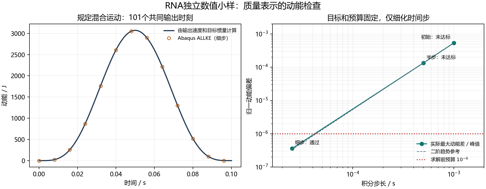

# RNA独立小样验证：结果、真实依据与适用范围

日期：2026-10-05。任务：T038-S1。**本步独立数值验证完成；整塔/运行RNA适用性尚未据此通过。**

## 1. 实际完成了什么

在用户本机Abaqus/Standard 2025执行5次独立求解：质量矩阵、固定参考点重力、原步长规定运动、半步长规定运动及细步长规定运动。5次均正常完成，原始MSG均报告0输入警告、0分析警告、0错误。

三类最终核验均满足求解前登记的数值预算。初始及半步规定运动虽正常完成，但动能未达到预算；这两次作为未达标结果保留，没有删除，也没有放宽容差或调整质量/惯量来使结果通过。

本步没有修改M2整塔，没有运行OpenFAST风况，没有开展材料疲劳寿命计算。原M2输入SHA仍为`428a8bb567a52200311ebb1a2019a71c304d1c427ce761f0c836e4fc46fe50f1`。

## 2. 真实参考方法，以及本研究自己的部分

**Cheng Y.等（2024），Structures 68，107235，DOI：[10.1016/j.istruc.2024.107235](https://doi.org/10.1016/j.istruc.2024.107235)。** 本轮实际核读PDF第3–9页相关内容并核图。第6–7页§4.1及图5采用机舱、转子两个参考点，分别设置集中质量和转动惯量，并刚性运动学耦合到塔顶；第7页§5.1与第9页图7/表4比较PM、EPM、EPMJ和EDPMJ。当前单偏心集中质量加惯量的表示概念上接近EPMJ。

该论文不提供本机组的数值、不披露MASS/ROTARYI关键词，文中未报告本小样所用的完整6×6质量矩阵提取、重力与动能核验流程。不能说本步是对该文算例的复现。

该文PDF在仓库参考文献目录中存在，已核对当前快照的路径、大小和Git对象，记录见`reference-github-presence.json`。本轮方法核读使用另一本地PDF副本，来源SHA256见`literature-method-source-public.json`；两个副本字节数不同，不声称逐字节相同。

**Abaqus官方方法**提供质心节点MASS、六分量ROTARYI、六自由度KINEMATIC耦合、MATRIX GENERATE/MPC=YES、GRAV、RF/RM/V/VR/ALLKE以及隐式积分/幅值曲线的确切定义。逐项章节和链接见`method-source-review.md`。目标RNA参数来自已逐字节复核的R2归档与T038输入重建；刚体质量矩阵、平行轴和动能等价由本项目解析推导并交叉核验。

1e-9的矩阵预算、1e-6的反力/动能预算属于求解前公开登记的数值实施预算。它们不是论文数值、规范限值或实际机组的工程误差门槛。详细来源范围见`literature-method-source-public.md`和`RESEARCH_CARD.md`。

## 3. 小样对象

- 总质量：676753.2907231401 kg。
- 公共塔顶O：(0,158,0) m，Abaqus +Y竖直。
- 整体质心G：约(0,160.78358803030605,−0.8729624988915398) m。
- 在G赋MASS和完整质心惯量，通过六自由度运动学耦合连接O；使用原始惯量张量非对角符号。
- 目标状态：未变形、内部相对运动锁定的R2独立float64重建。它不是原OpenFAST求解器直接导出的完整高精度矩阵，也不代表叶片柔性、旋转和气弹响应。

R2原ED.sum质量与本次float64目标仍差0.040723140119 kg；本次没有消除或掩盖这个既有来源差异。

## 4. 实际结果

|检查|实际差异|预登记预算|结果|
|---|---:|---:|---|
|质量矩阵：平移、偏心耦合、转动分别按同量纲块比较|最大归一误差3.699e-16|1e-9|通过|
|从求解器矩阵反求m/CG/JG|质量和CG在记录精度内一致；JG归一误差3.8232e-16|质量/JG 1e-9；CG 1e-8 m|通过|
|重力支座合力与O点反力矩|最大归一误差3.308e-08|1e-6|通过|
|细步规定运动ALLKE，两条解析路线|最大归一误差3.608e-07|1e-6|通过|

重力试验给定a=(0,−9.81,0) m/s²；支座RF2实际6638950.0 N、目标6638949.781994005 N；RM1实际5795554.0 N·m、目标5795554.191704930 N·m。差值与ODB单精度输出分辨率一致，偏心反力矩方向正确。

矩阵文件实际只含O点1–6六个独立自由度，15个非零下三角项；按显式节点/自由度标签恢复对称矩阵，没有把重复对称项加倍。

## 5. 动能未达标如何处理

|积分步长/s|输出样本|两条路线最大绝对动能差/J|按峰值归一差异|判定|
|---:|---:|---:|---:|---|
|0.001|101|1.63811976|0.000532959004|未达原预算|
|0.0005|201|0.409604138|0.000133317177|未达原预算|
|2.5e-05|101|0.00110836947|3.60797985e-07|通过|

两条路线分别使用O点实际输出速度与目标M6、G点实际输出平动/转动速度与m/JG。初始与半步误差约呈四分之一关系；细步在101个共同输出时刻满足原预算。细步实际执行4000个增量，场/历史每40增量保存一次，不能把这101点结论宣称为逐增量全部输出检查。

规定运动的输出速度与Newmark增量更新速度存在可诊断的离散差异。官方隐式动力学理论及实际原步/半步诊断支持这一解释；本步保留原V/VR—ALLKE验收定义，并用细步实际结果达到预算，没有通过改换定义掩盖原失败。该检查是规定运动下的质量/耦合/动能核验，不是整塔自由振动或运行风况的时间步收敛试验。

## 6. 发现并保留的其他问题

- 旧`openfast-rna-current.json`单叶质量摘要字段误匹配了ED.sum整机总质量；正确单叶打印值为41732.340 kg。目标m/CG/J由真实分布与组件字段组装，不使用该错误字段。独立组件重组再次确认目标不受影响；`source-summary-erratum.json`明确勘误，原始指纹保留。
- 首次两次ODB抽取因float32不能直接JSON序列化失败；已显式转换数值类型后重新读取同一ODB。没有重跑求解或修改输入。失败脚本和错误记录保留。

## 7. 对下一步的实际意义

在本小样设定与登记的数值预算内，本步结果证明：指定的R2冻结RNA质量算子能够在Abaqus中用集中质量、完整惯量及偏心耦合正确表达。它为后续选择整塔RNA表示提供了可复算的数值证据。

接入整塔之前仍需审定载荷自由体：若Abaqus承受已包含RNA重力/惯性的完整塔顶截面内力，就不能再重复计入同一RNA作用。真实柔性/旋转/气弹影响、当前整塔阻尼、载荷映射和疲劳输入仍各有独立验证任务；BASE001、D08及疲劳寿命状态不自动升级。

## 8. 文件与复现

- 原始求解目录：`D:/Codex-research-validation/T038S1/`。
- 每个作业原INP、DAT、MSG、STA、ODB、矩阵及执行记录以无损ZIP归档；`raw-bundle-manifest.json`登记逐文件SHA256。
- `build_sample.py`生成最初三输入；`register_refinement.py`生成有记录的时间步对照；`run_sample.py`记录本机执行；`extract_odb.py`读取实际ODB；`verify_sample.py`复算全部比较；`assemble_delivery.py`生成图表与交付。
- `source-identity-review`、两份独立结果审查和方法来源记录保留每项依据与适用范围。文献原PDF页面、论文正文和导师材料未进入本公开包。
- 环境：求解与ODB抽取使用Abaqus/Standard 2025及其自带Python；数值后处理使用Python和NumPy；本报告绘图实际使用Python 3.13、NumPy 2.2.5、Matplotlib 3.10.3及Windows微软雅黑字体。发布脚本另需已认证GitHub CLI。
- 脚本保留本轮实际Windows路径，下载后不是开箱即用的跨平台软件包。仅复查已有结果时，可将ZIP分别解压至对应作业目录并读取JSON/CSV；重新求解应复制到新的工作目录，避免覆盖原始记录。`build_sample.py`还依赖T038的`comparison-results/rna-comparison.json`；动能诊断脚本保留原`work/step3-rna-20261005`位置假设，异机复现需调整路径。
