# 李泽宇博士论文第4章建模方法原文截图索引

> 直接由仓库原PDF渲染。PDF页码为文件页码，文件名同时标注论文印刷页。

- PDF p.81: 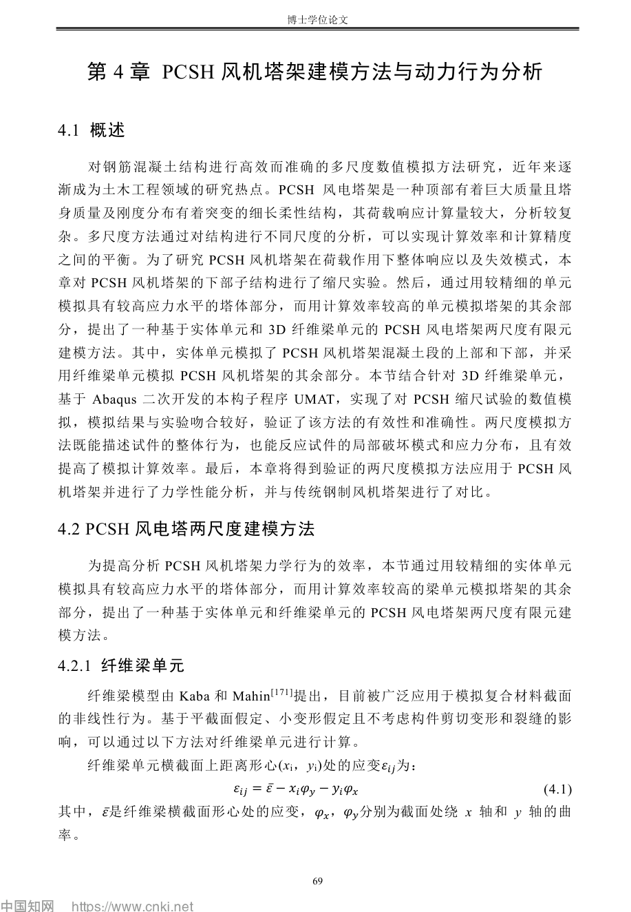
- PDF p.82: 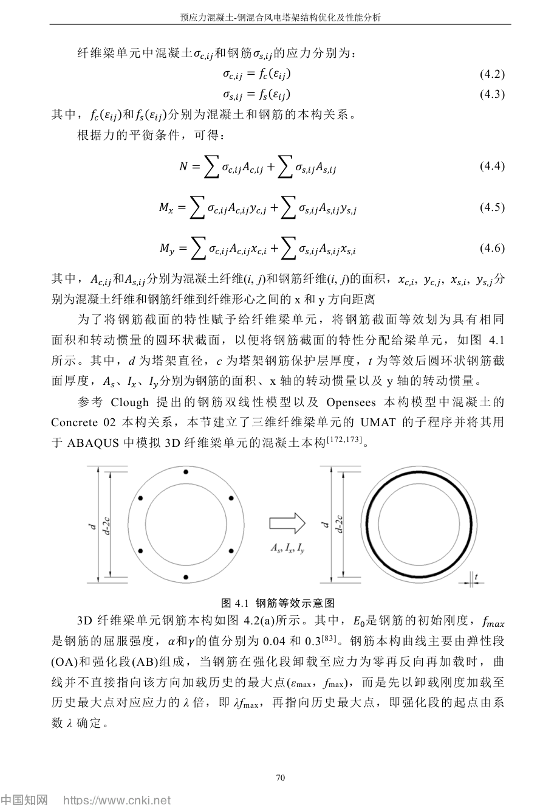
- PDF p.83: 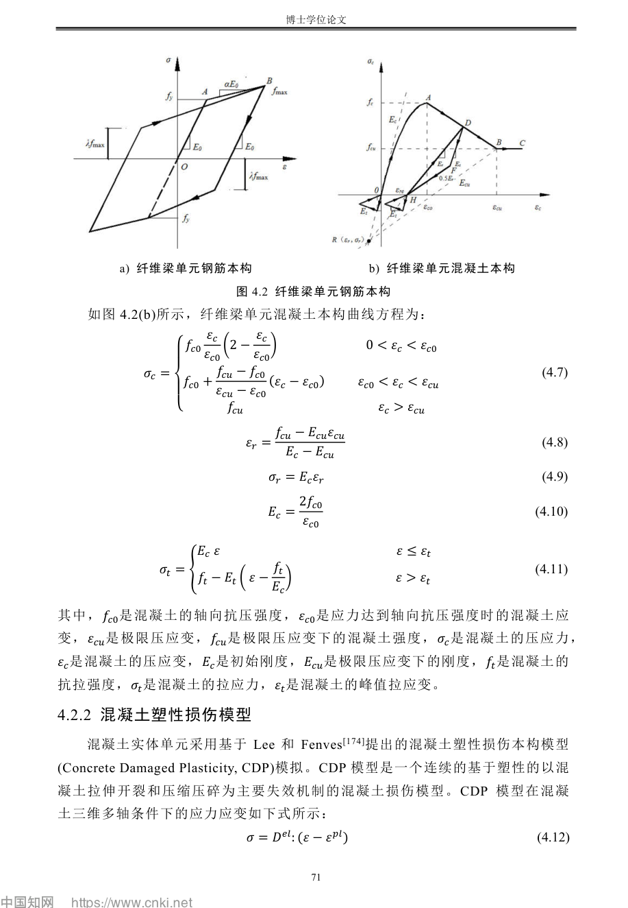
- PDF p.84: 
- PDF p.85: 
- PDF p.86: 
- PDF p.87: 
- PDF p.89: 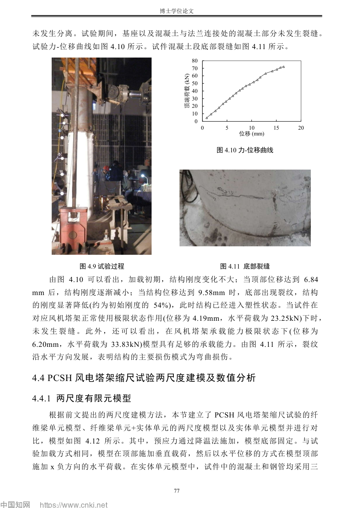
- PDF p.90: 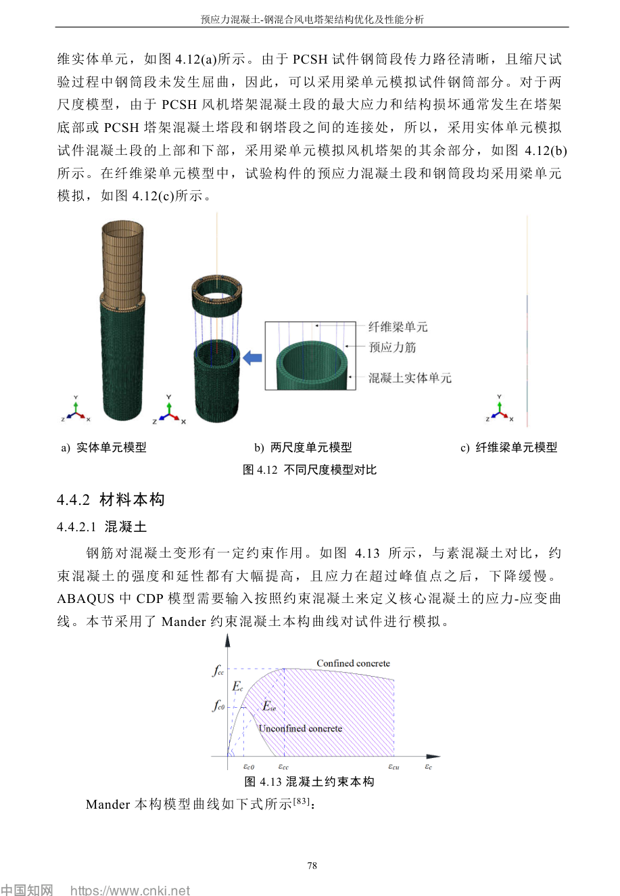
- PDF p.91: 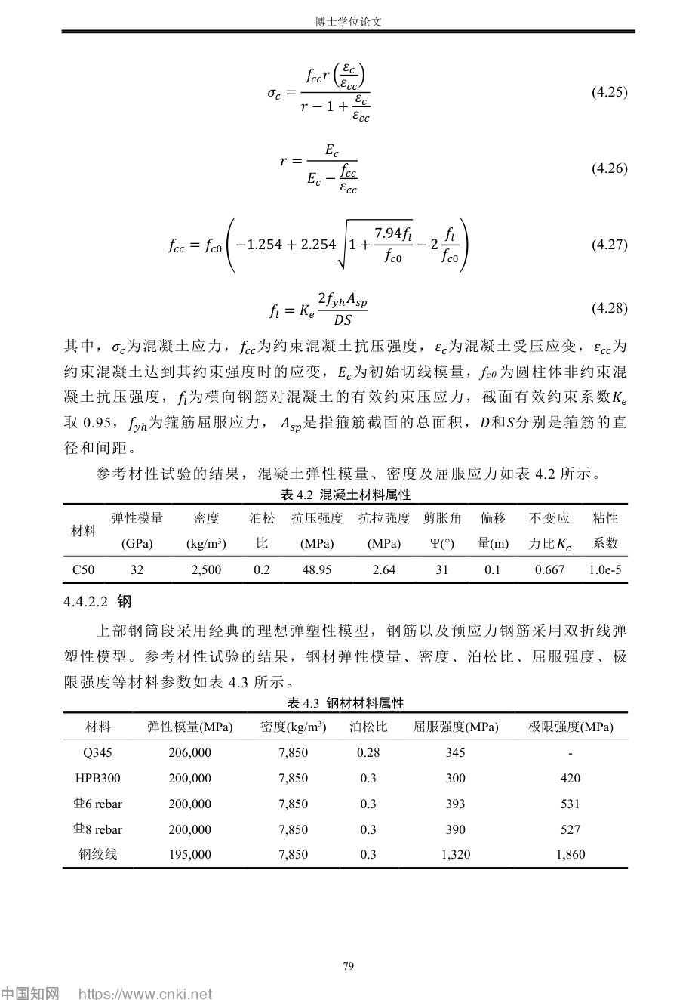
- PDF p.92: 
- PDF p.95: 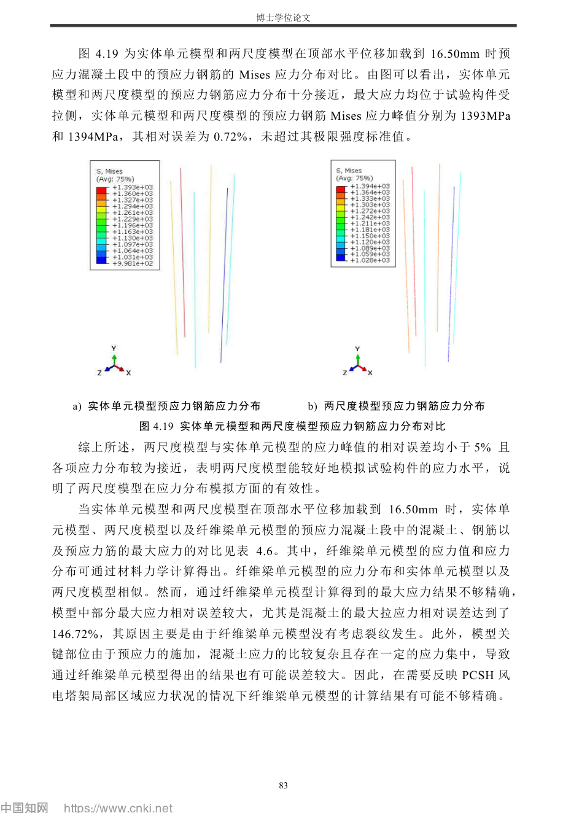
- PDF p.96: 
- PDF p.97: 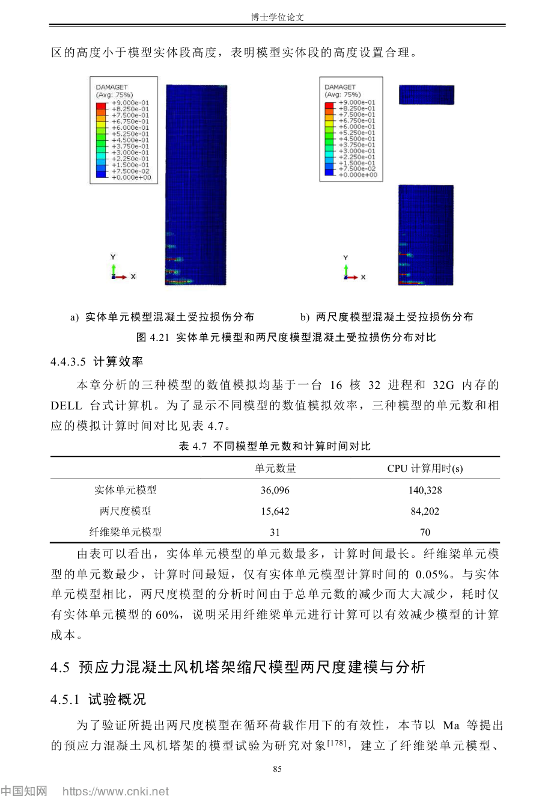
- PDF p.100: 
- PDF p.102: 
- PDF p.103: 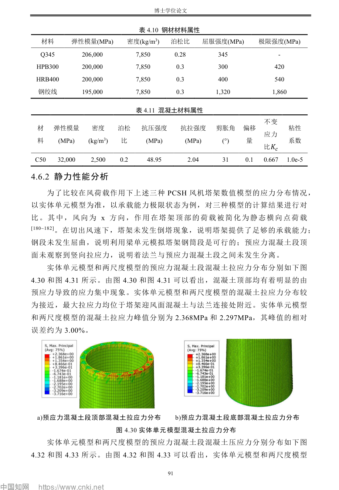
- PDF p.104: 
- PDF p.106: 
- PDF p.107: 
- PDF p.108: 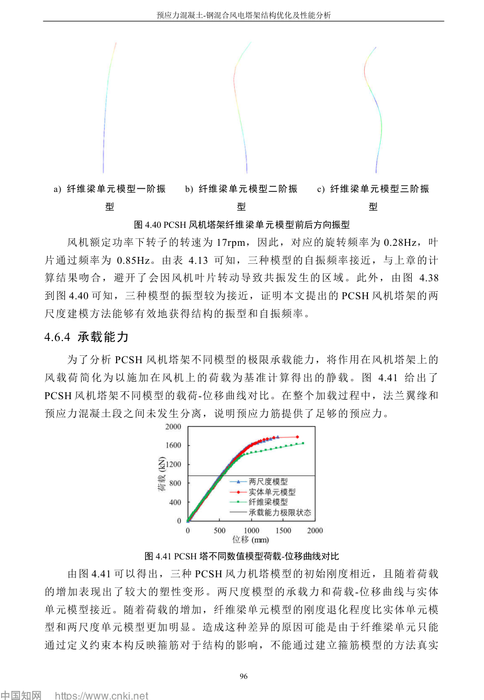
- PDF p.109: 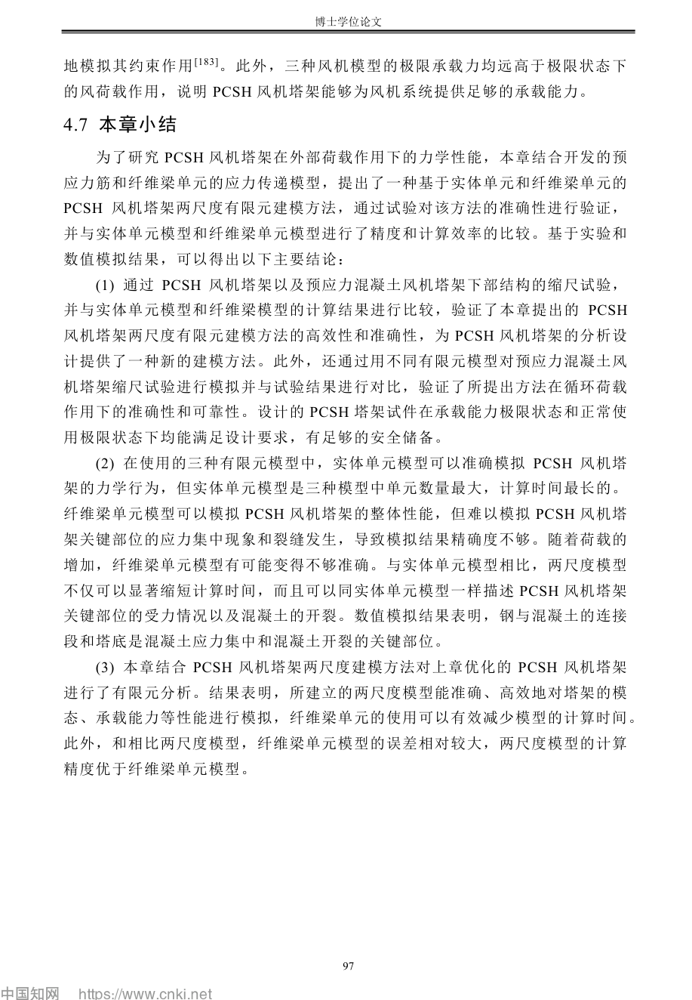
