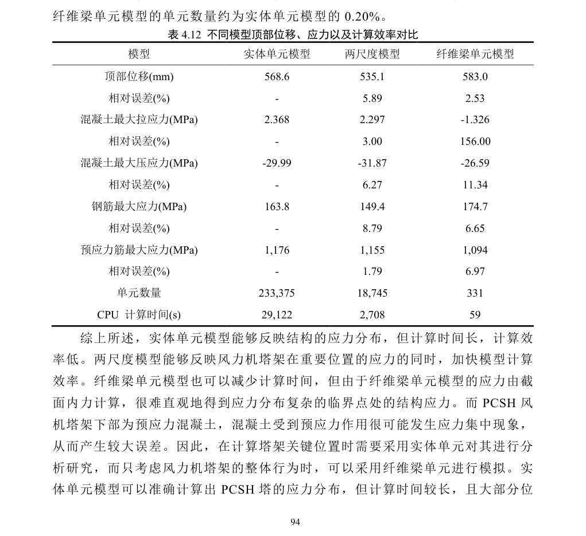
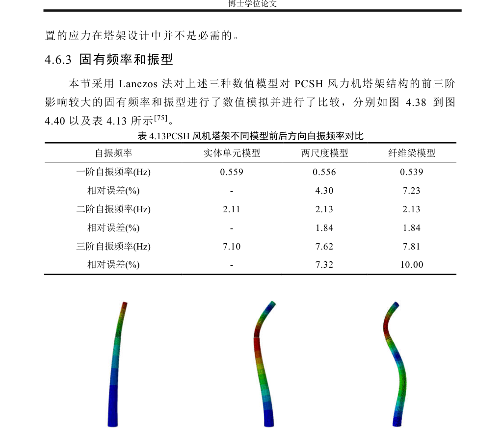
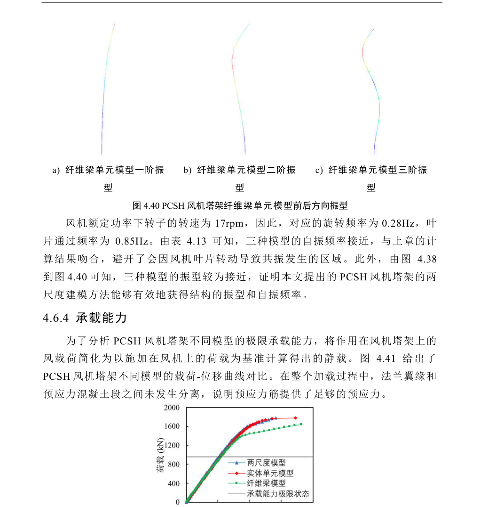
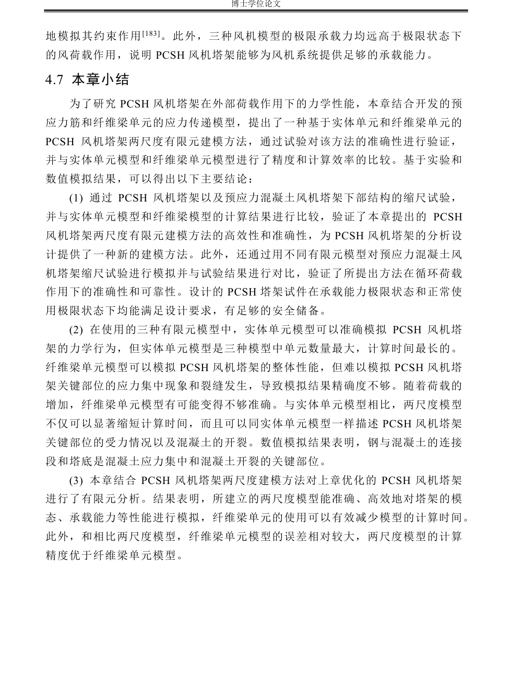
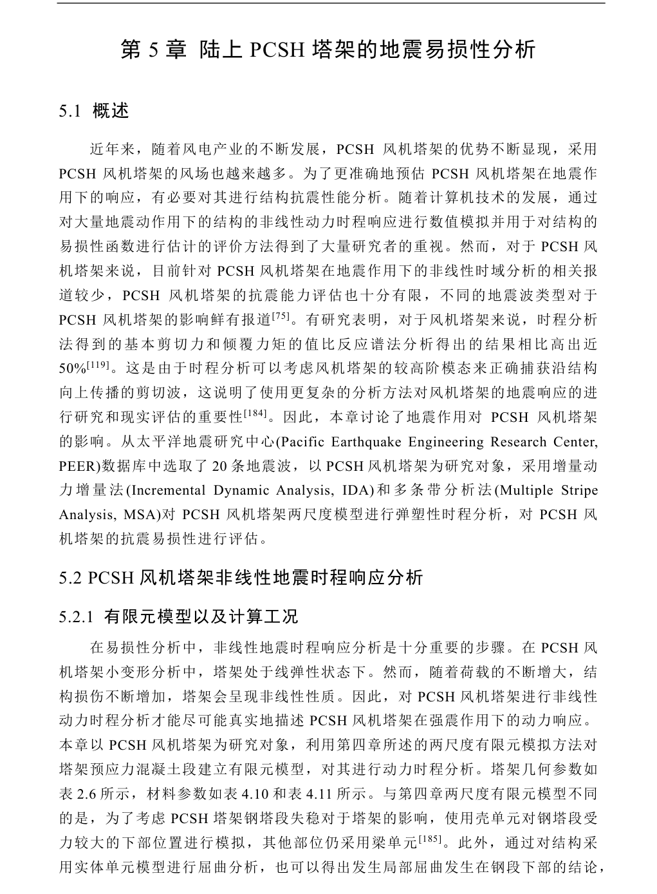
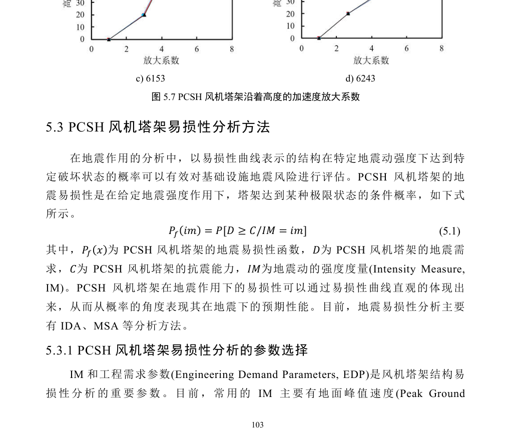
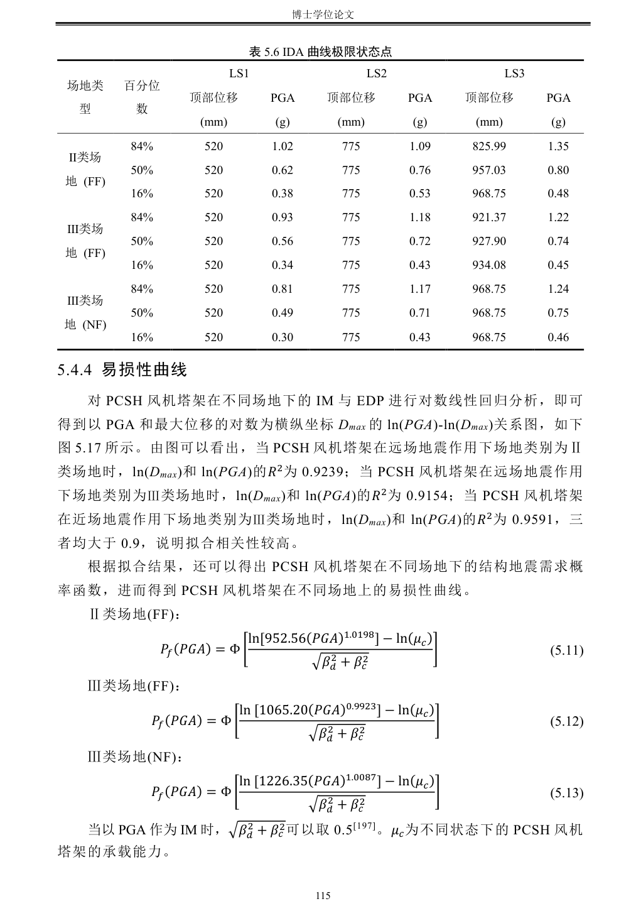
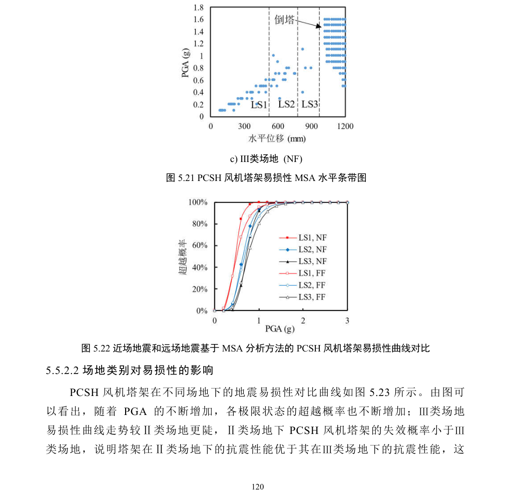

# 李泽宇博士论文正文定向截图索引

> 截图直接来自仓库原PDF，仅保留对应表格/图/结论上下文区域。PDF页码为文件页码；文件名同时标出论文印刷页码。

- PDF p.106: 
- PDF p.107: 
- PDF p.108: 
- PDF p.109: 
- PDF p.110: 
- PDF p.111: 
- PDF p.112: 
- PDF p.114: 
- PDF p.115: 
- PDF p.116: 
- PDF p.118: 
- PDF p.119: 
- PDF p.121: 
- PDF p.122: 
- PDF p.124: 
- PDF p.125: 
- PDF p.126: 
- PDF p.127: 
- PDF p.128: 
- PDF p.132: 
- PDF p.133: 
- PDF p.136: 
- PDF p.137: 
