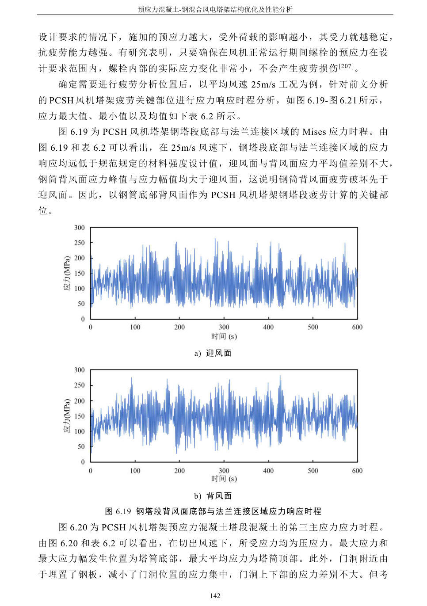

# 李泽宇博士论文第6章原文截图索引

> 直接由仓库原PDF渲染。PDF页码为文件页码，文件名同时标注论文印刷页。

- PDF p.138: 
- PDF p.139: 
- PDF p.140: 
- PDF p.143: 
- PDF p.144: 
- PDF p.145: 
- PDF p.146: 
- PDF p.148: 
- PDF p.149: 
- PDF p.150: 
- PDF p.151: 
- PDF p.152: 
- PDF p.153: 
- PDF p.154: 
- PDF p.156: 
- PDF p.157: 
- PDF p.158: 
- PDF p.159: 
