# 李泽宇博士论文第4章 vs T057：Abaqus建模方法逐项对照审计

> 日期：2026-10-07  
> 用途：把 REF007 李泽宇博士论文第4章的真实建模做法，与当前10 MW / 158 m混塔候选 T057 逐项比较。  
> 原则：只迁移“方法证据”，不迁移2 MW/77.5 m试件或足尺模型的案例参数。  
> 当前T057身份仍为 **EVIDENCE-RECONCILED CANDIDATE / NATIVE-SOLVER-PENDING**。

## A. 两个模型不是同一个研究对象

| 项目 | 李泽宇博士论文 | 当前T057 | 结论 |
|---|---|---|---|
| 风机/塔架 | 2 MW、77.5 m PCSH | DTU 10 MW + 158 m混塔 | 参数绝不能互抄 |
| 目的 | 提出并验证“两尺度FE” | 建立可用于局部应力/疲劳的精细FE候选 | 方法可互证，目标不同 |
| 混凝土塔 | 预应力混凝土段 | 112 m、31段预制混凝土 | T057更强调分段/接缝 |
| 钢塔 | 上部钢塔 | 46 m钢塔 | 结构角色一致，尺寸不同 |
| 顶部风机 | 质量块 + 外加横向力/弯矩 | RNA-R2：质量+偏心CG+full inertia+6DOF | T057惯性等效更细 |
| 接缝 | 第4章主要研究连续PC段/钢混连接；没有30个分段水平接缝物理接触问题 | 30对水平接缝 hard contact + friction | 李泽宇不能作为T057水平接缝参数来源 |

---

## B. 混凝土实体：可以直接借鉴的方法证据

李泽宇第4章正文明确：

- 实体区混凝土采用 **C3D8R**；
- 采用 **Concrete Damaged Plasticity (CDP)**；
- 拉伸软化采用**断裂能开裂准则**，目的之一是改善软化区的网格客观性和收敛性；
- 缩尺试验部分采用 Mander 约束混凝土关系描述箍筋约束作用；
- 通过受拉/受压损伤云图与试验裂缝位置比较，而不是只比较模态。

原文证据：

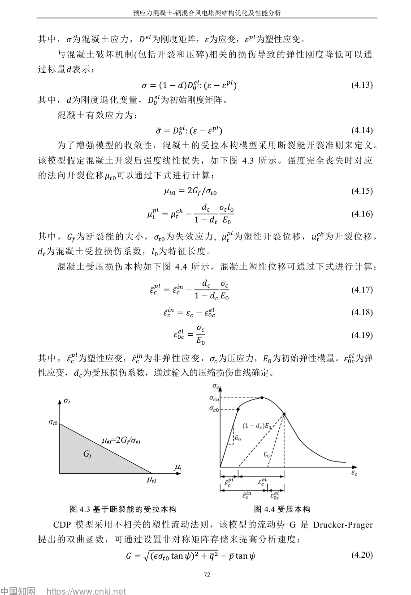

### 对T057的意义

T057当前精细混凝土路线与“关键区域必须用实体单元得到局部应力/损伤”这一原则高度一致。

但李泽宇给T057新增了一个**必须核查的材料门禁**：

> **T057当前CDP拉伸软化究竟是不是fracture-energy regularized？**

如果T057仍采用应力—开裂应变/塑性应变软化，却没有按特征长度或断裂能处理，则：

- DAMAGE/裂缝相关结果会随网格尺寸变化；
- 局部拉应力/损伤热点可能不具备网格客观性；
- 后续用局部混凝土应力做疲劳时，必须先做网格/提取收敛。

因此：

**李泽宇可以支持“C3D8R + CDP + fracture-energy regularization”的方法路线，但不能提供T057的C70/C65材料参数。**

---

## C. 普通钢筋：Embedded方法可以借鉴，配筋数值不能借鉴

李泽宇第4章：

- 实体区普通钢筋用 **T3D2**；
- 通过 **Embedded** 嵌入混凝土；
- 两尺度梁区则把钢筋等效为截面纤维；
- 缩尺试验采用的钢筋直径/数量是试件自己的参数。

原文证据：

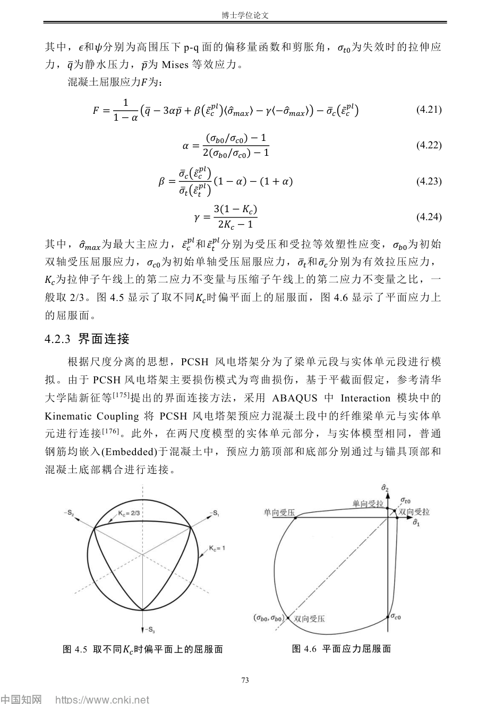

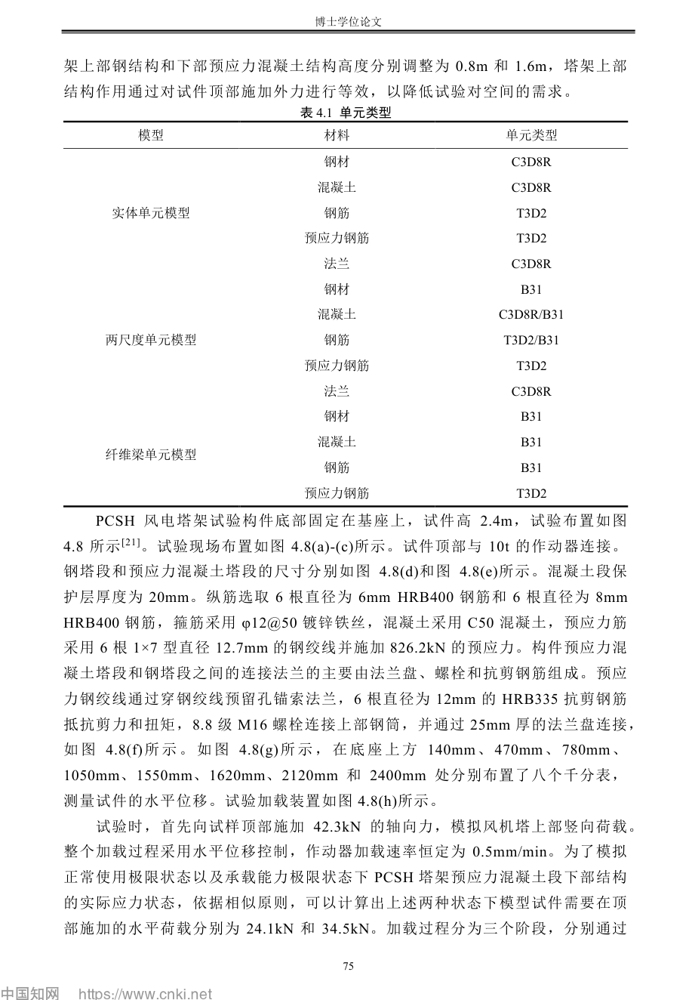

### T057现状

T057：

- 31段内外双排纵筋数量继承何泽瑜2024；
- 纵筋单根面积490.874 mm²（等效φ25）为规范验证重建值，不是何泽瑜直接公开值；
- 环筋/拉筋/保护层为规范补全；
- 显式钢筋体系进入当前精细模型。

### 审计结论

**可以继承：**
- 钢筋显式T3D2/Embedded于实体混凝土的建模思想；
- 局部钢筋应力应和实体混凝土热点一起验证。

**不能继承：**
- 李泽宇缩尺试件的φ6/φ8/φ12、HRB400等数值；
- 李泽宇足尺2 MW模型中的HPB300/HRB400材料直接替代T057 HRB335。

T057钢筋的数值身份仍按当前治理：
- 数量：He2024直接；
- φ25等效面积：规范验证重建；
- 材料：Xu-He-Wang 2025同对象HRB335。

---

## D. 预应力筋：李泽宇对“自由滑动”和损失”的证据非常重要

李泽宇第4章明确：

- 预应力筋用 **T3D2**；
- 实体模型中PT顶端与锚具/法兰连接，底端与混凝土底部/基础连接；
- 两尺度梁区不能把PT直接压到梁中心线上；
- 采用 **Cartesian + Align** 连接：
  - 垂直于PT方向的横向位移与梁截面映射点一致；
  - **沿PT轴向允许自由滑动**；
- 这是用来表达无粘结预应力筋的运动学特征；
- 预应力采用**降温法**施加；
- 足尺模型还考虑：
  - 锚固损失；
  - 摩擦损失；
  - 应力松弛；
  - 混凝土徐变；
  - 混凝土收缩。

原文证据：

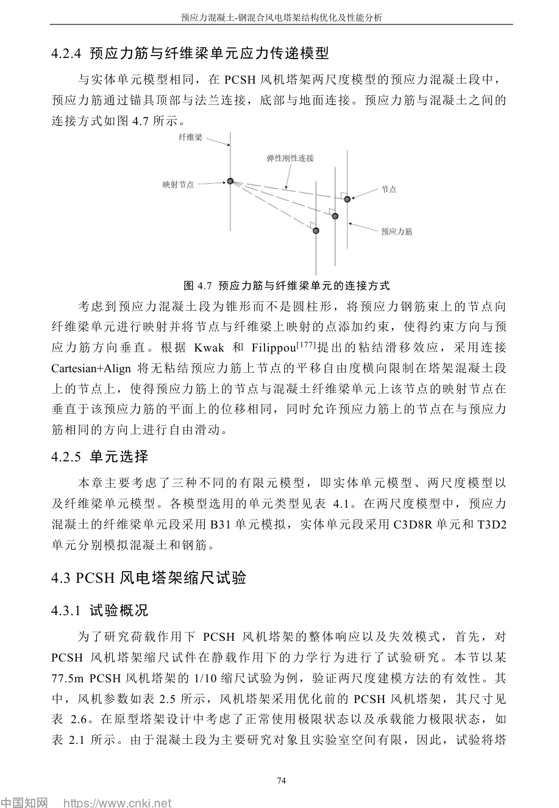

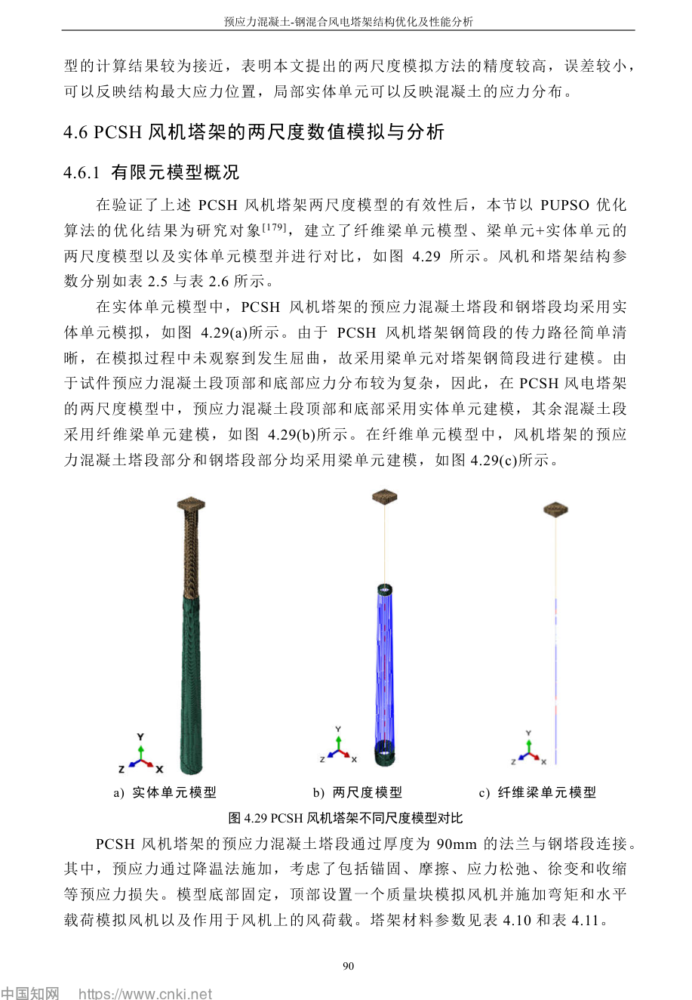

### T057现状

T057当前：

- 36个周向PT束位置；
- 每位置 8×140 mm² = 1120 mm²；
- 总面积40320 mm²；
- 名义初应力1280 MPa；
- PT半径 r=1.75 m；
- 顶部通过转换法兰/RP/Equation体系传力；
- 底部平移固定；
- 1280 MPa当前只能叫**名义初始输入**，不是平衡后实际有效预应力。

### 新增关键门禁

李泽宇这部分对T057提出两个必须关闭的问题：

#### D1. PT—混凝土“无粘结/外置”运动学是否正确

如果T057的PT是外置/无粘结体系，必须确认：

- PT在塔身中段是否被错误地与混凝土轴向完全粘结；
- 横向定位约束是否允许PT沿自身方向产生相对滑移；
- PT转折/锚固处是否正确传力。

不能因为“PT几何画在混凝土里面/附近”就默认运动学正确。

#### D2. 有效预应力损失如何处理

T057目前使用1280 MPa名义初应力，但李泽宇足尺模型明确把多类损失纳入。

因此在本文要做**材料疲劳平均应力**时，不能把1280 MPa直接写成运行期PT平均应力。

至少必须二选一：

1. 建立有依据的有效预应力损失模型；或
2. 明确本文以平衡后solver S11/轴力为初始有效状态，并对长期损失设置敏感性/保守边界。

当前总控中“Gravity/PT/contact equilibrium后检查36束S11/轴力”是必要但未必充分的第一步。

---

## E. 实体—梁接口：李泽宇做法清楚，但T057不需要照搬

李泽宇两尺度模型采用：

- 实体区 + B31纤维梁区；
- 两者通过 **Kinematic Coupling** 连接；
- 依据主要损伤为弯曲、平截面假定成立，将梁截面运动映射到实体端面。

原文：

### T057

T057目前不是李泽宇的两尺度纤维梁塔身模型，因此：

- 不需要为了“像李泽宇”而强行加入B31/UMAT；
- 当前关键是把全局载荷和局部实体/钢塔模型做可信闭合。

### 结论

李泽宇的Kinematic Coupling只支持：

> 当未来需要“快速全局模型 + 局部实体子区”时，这是有试验验证先例的方法。

它**不能直接证明T057现有钢—混转换Tie/RP/Equation一定正确**。

T057转换段仍必须按当前G1检查六分量反力/力矩传递。

---

## F. 钢—混转换：李泽宇证明“这里会应力集中”，但不能证明T057连接拓扑

李泽宇足尺分析反复发现：

- PC顶部与法兰连接附近混凝土拉/压应力集中；
- 普通钢筋最大应力也靠近该区域；
- PT最大应力出现在迎风侧；
- 纯纤维梁无法准确捕捉这一局部热点。

足尺结果：

- 两尺度 vs 实体混凝土拉应力峰值：2.297 vs 2.368 MPa，误差约3%；
- 压应力：31.87 vs 29.99 MPa，误差约6.3%；
- 钢筋：149.4 vs 163.8 MPa，误差约8.8%；
- PT：1155 vs 1176 MPa，误差约1.8%。

原文：

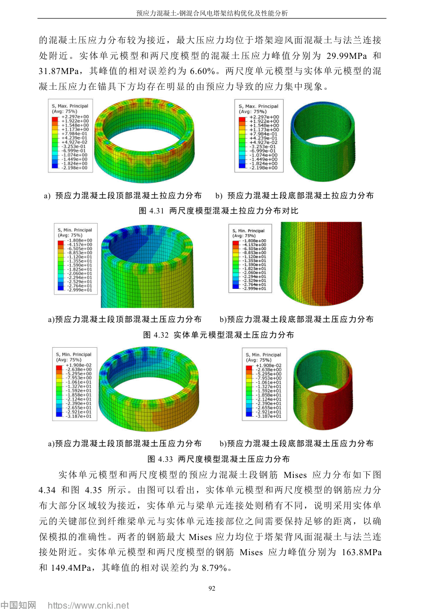

### 对T057的直接意义

这强烈支持我们当前Ch4把：

[
oxed{	ext{钢—混转换/法兰/PT锚固附近}}
]

列为第一批局部疲劳候选区域。

但：

- 李泽宇的90 mm法兰；
- 其2 MW连接尺寸；
- 其连接细节；
- 其应力数值；

均不能直接迁移到T057。

T057当前转换拓扑：
- TIE_C31_S01；
- flange RP kinematic coupling；
- 36个PT顶部节点；
- 108个Equation；

只完成**静态拓扑闭合**，仍需T057原生求解验证实际六分量传力。

---

## G. 水平分段接缝：这是李泽宇第4章不能帮T057闭合的地方

T057有：

- 31个混凝土段；
- 30对水平界面；
- hard normal contact；
- penalty friction；
- μ=0.5。

李泽宇第4章两尺度研究的主要对象不是“31段预制水平接缝开合/滑移”，因此不能拿其第4章作为：

- μ=0.5来源；
- 30个接缝接触算法来源；
- 接缝开缝/滑移承载机理来源。

T057这部分仍必须依靠当前REF015/016/017/026等**水平接缝试验+FE文献**，而不是REF007。

这项分类：

[
oxed{	ext{REF007 = NOT APPLICABLE as direct joint source}}
]

---

## H. 钢塔单元：不能因为李泽宇用B31，就把T057钢塔也简化成梁

李泽宇第4章中，两尺度模型把钢塔用B31，是因为：

- 该研究阶段钢筒传力路径较清楚；
- 对应缩尺试验中钢段未屈曲；
- 足尺常规风载分析中也未观察到钢段屈曲；
- 研究重点是PC混凝土段局部行为。

但李泽宇第5章做地震易损性时，为捕捉钢塔局部屈曲，又把钢塔下部升级为壳单元。

这给T057一个重要原则：

> **单元类型必须服务于要研究的失效机制。**

当前T057如果最终要评价钢塔局部疲劳/热点，应先解决：
- SSEG_01–04网格质量；
- 1512个>100:1高长宽比风险；
- 局部应力网格收敛。

因此不能拿“李泽宇常规分析钢塔用梁”作为理由，把T057钢塔局部疲劳模型降阶。

---

## I. RNA：T057比李泽宇第4章的顶部质量块更精细

李泽宇足尺第4章：

- 塔底固定；
- 顶部设置质量块模拟风机；
- 同时施加横向荷载和弯矩代表风机气动/结构作用。

这足以服务他的“比较三种塔架FE离散方法”目标。

T057则已经采用RNA-R2：

- 质量 676753.290723 kg；
- 偏心CG；
- full rotary inertia；
- O→G 6DOF运动学耦合。

因此：

[
oxed{	ext{T057不应回退为单点质量}}
]

REF007只能作为“顶部等效RNA在塔架结构分析中有先例”的旁证，当前RNA的直接证据仍应来自DTU/OpenFAST和REF010等。

---

## J. 塔底边界：两者都采用固定，但适用边界必须写清

李泽宇：

- 缩尺试件底部固定；
- 足尺陆上塔模型底部固定。

T057当前也采用塔底固定。

这可以作为一种常见的“上部塔架局部响应研究”边界假设先例。

但固定底不能证明真实基础柔度无影响。论文中必须写清：

> 本文研究边界从塔基接口以上开始，基础—土体柔度不在当前研究范围内。

如果未来结果对一阶频率/塔底应力高度敏感，则需要基础柔度敏感性，而不是引用李泽宇一句“底部固定”就结束。

---

## K. 预应力施加：方法可不同，但必须验证最终平衡状态

李泽宇：

- 采用降温法施加PT；
- 足尺还考虑多类预应力损失；
- 通过“法兰与PC段未分离、PT应力、局部应力”验证状态。

T057：

- 当前保留1280 MPa名义初应力；
- 真正有效状态尚待 Gravity/PT/contact equilibrium。

因此本文不需要机械复制“降温法”，但必须满足同一个物理要求：

[
oxed{	ext{最终预压状态和传力必须可验证}}
]

建议T057最少输出：
- 36束PT平衡后S11与轴力；
- 总有效预应力；
- 各水平接缝CPRESS/COPEN/CSHEAR；
- 塔底RF/RM；
- 转换界面六分量；
- PT锚固节点约束力；
- 初始输入与平衡后状态差值。

---

## L. 验证层级：T057现在最应该学习李泽宇的部分

李泽宇不是只做模态。

### L1 缩尺PCSH静载试验
1/10缩尺；2.4 m总高；0.8 m钢段+1.6 mPC段。

- 顶部轴向荷载42.3 kN；
- SLS目标水平荷载24.1 kN；
- ULS目标水平荷载34.5 kN；
- 水平位移控制0.5 mm/min；
- 底部弯曲裂缝是主要失效模式。

### L2 三模型 + 试验
顶部位移16.5 mm时：
- 试验72.22 kN；
- 实体68.79 kN（4.75%）；
- 两尺度67.56 kN（6.45%）；
- 纤维梁77.18 kN（6.87%）。

关键局部应力中：
- 两尺度与实体多数峰值误差 <5%；
- 纯纤维梁混凝土最大拉应力误差可超过150%。

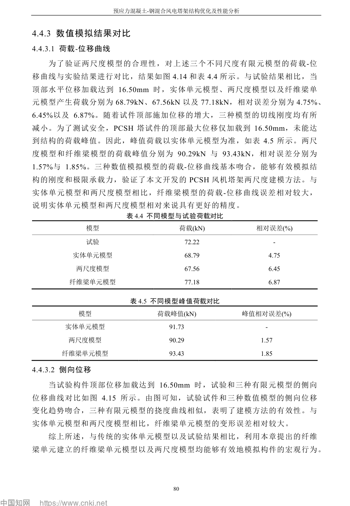

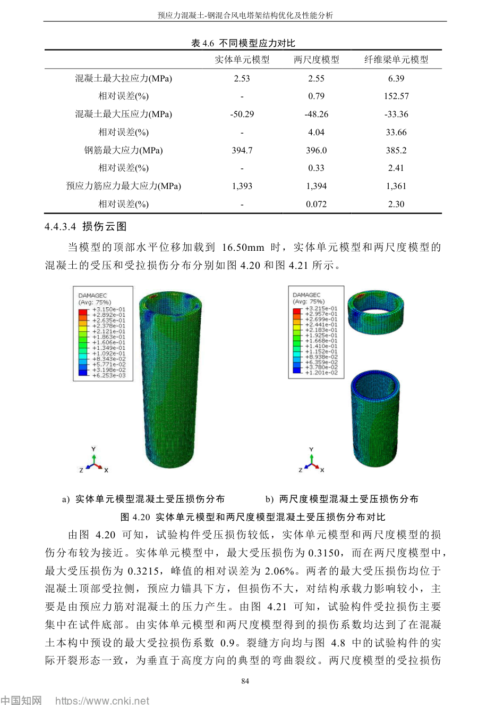

### L3 循环试验
又用另一预应力混凝土塔缩尺循环试验验证：
- 低周反复位移加载；
- 每级循环3次；
- 实体/两尺度模型相对试验误差均不大于约10%。

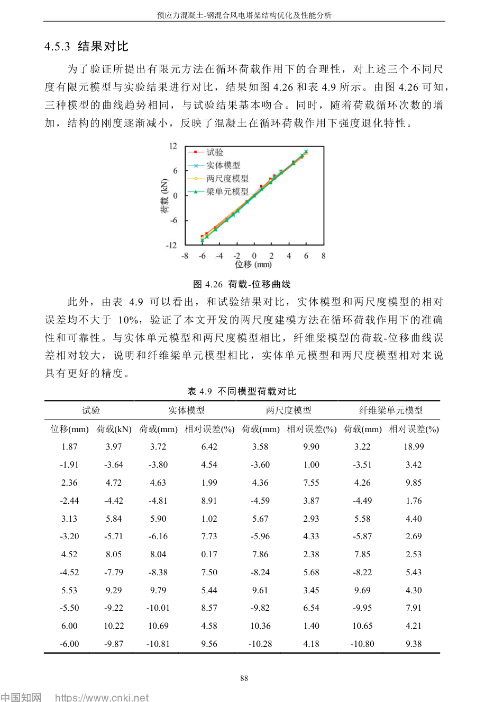

### L4 足尺模型
最后才用于足尺2 MW塔，并验证：
- 局部应力；
- 位移；
- 模态；
- 承载能力；
- 计算效率。

这说明T057的可信度也必须分层：

[
	ext{Data Check}

ightarrow
	ext{Gravity/PT/contact}

ightarrow
	ext{mass/CG/J}

ightarrow
	ext{Modal/Flex}

ightarrow
	ext{mesh/local stress}

ightarrow
	ext{fatigue}
]

不能只用“首阶频率很接近”宣称整个局部模型正确。

---

## M. 计算效率：为什么当前T057不需要模仿两尺度，但以后优化可以

李泽宇足尺表4.12：

| 模型 | 单元数 | CPU时间 |
|---|---:|---:|
| 全实体 | 233375 | 29122 s |
| 两尺度 | 18745 | 2708 s |
| 全纤维梁 | 331 | 59 s |

两尺度：
- 单元数约为全实体8.03%；
- CPU时间约为全实体9.30%；
- 仍能较好捕捉关键局部应力。

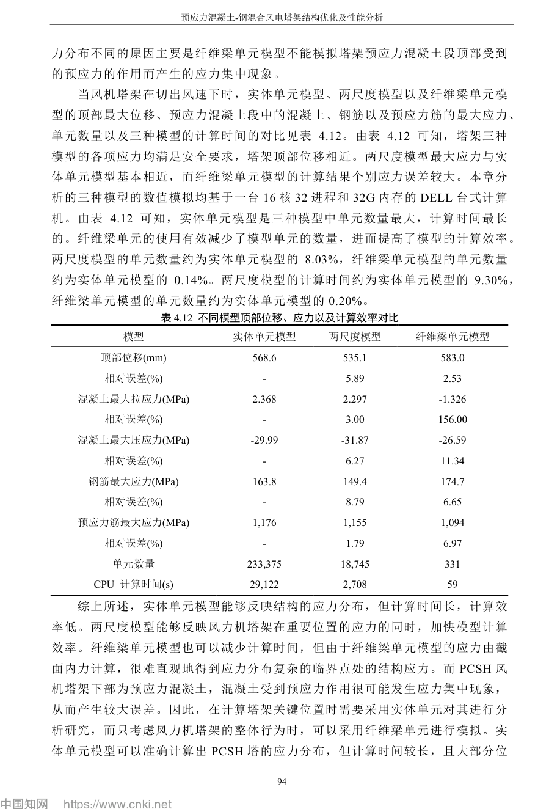

### 对T057

当前T057的首要任务是：

> **把一个高可信精细模型做对。**

不是再开发自研UMAT。

但如果未来需要：
- 大量参数敏感性；
- 结构优化；
- 长时程大量重复FE；

则可以另建“快速全局/两尺度模型”，用T057作为高保真基准校核。

---

## N. 模态：李泽宇证明“模态吻合只是验证的一层”

足尺三模型：

| 模型 | f1 | f2 | f3 |
|---|---:|---:|---:|
| 实体 | 0.559 | 2.11 | 7.10 |
| 两尺度 | 0.556 | 2.13 | 7.62 |
| 纤维梁 | 0.539 | 2.13 | 7.81 |

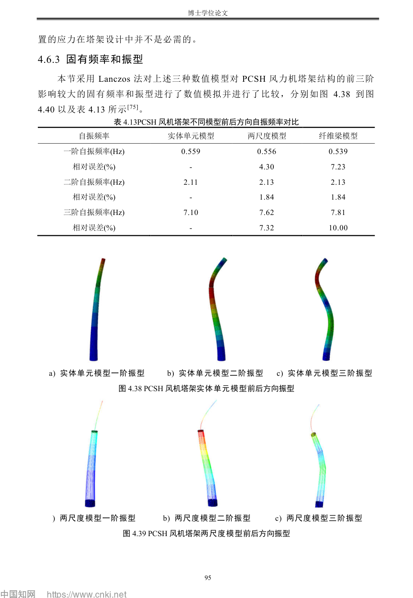

但同一章也证明：

> 即使全纤维梁整体位移和频率不错，局部混凝土拉应力仍可能误差超过150%。

因此对T057：

[
oxed{	ext{Modal PASS} 
eq 	ext{Local Stress PASS}}
]

这应该作为第二章模型验证的硬表述。

---

# O. 对T057的最终逐项裁决

| 建模项 | REF007能否支持T057 | 裁决 |
|---|---|---|
| 关键区使用C3D8R实体 | 可以，方法证据强 | **USE** |
| CDP描述混凝土非线性 | 可以，方法证据强 | **USE** |
| fracture-energy拉伸软化 | 可以作为方法参考 | **AUDIT T057** |
| 普通钢筋T3D2 + Embedded | 可以，方法证据强 | **USE** |
| T057纵筋φ25/根数 | 不可以 | **KEEP CURRENT SOURCE CHAIN** |
| PT用T3D2 | 可以，方法证据 | **USE** |
| PT允许轴向滑动的无粘结运动学 | 很重要 | **AUDIT T057 PT KINEMATICS** |
| PT 36×8、r=1.75 m | 不可以 | **KEEP CURRENT EVIDENCE CLASS** |
| 1280 MPa直接等于运行有效应力 | 不可以 | **FORBIDDEN** |
| PT损失要考虑 | 可以提供强旁证 | **ADD GATE/SENSITIVITY** |
| 实体—梁Kinematic Coupling | 只适用于两尺度模型 | **OPTIONAL FUTURE** |
| 30个水平接缝μ=0.5 | 不可以 | **REF015/16/17/26** |
| 钢—混转换是局部热点 | 可以，证据强 | **USE FOR REGION SCREENING** |
| T057现有Tie/RP/Equation正确 | 不可以 | **SOLVER REACTION CHECK** |
| 顶部单点质量 | 李泽宇用了，但T057不应退回 | **DO NOT DOWNGRADE** |
| 塔底固定 | 可作边界先例 | **USE WITH SCOPE LIMIT** |
| 只靠模态验证局部模型 | 明确不够 | **FORBIDDEN** |
| 全实体/两尺度分层V&V | 很强的方法依据 | **USE** |

---

# P. 本次对照新增的T057待办

这次不是把REF007“贴进参考文献”就结束，而是实际新增4个需要检查的技术点：

### P1 — T057混凝土拉伸软化网格客观性
核对当前CDP输入：
- 是否fracture-energy based；
- 若不是，软化参数怎样随网格特征长度处理；
- 局部拉应力/DAMAGET是否对网格敏感。

### P2 — T057 PT无粘结运动学
核对：
- PT中段是否允许沿束方向自由滑移；
- 是否仅提供横向定位；
- 是否存在不合理Embedded/Tie导致PT与混凝土轴向完全锁死。

### P3 — T057有效预应力与长期损失
在Gravity/PT平衡后：
- 输出每束S11/轴力；
- 区分“名义1280 MPa”与“平衡后有效状态”；
- 决定是否需要锚固/摩擦/松弛/徐变/收缩损失或敏感性包络。

### P4 — 钢—混转换关键区必须成为Ch4局部应力控制区
后续局部应力提取至少包含：
- PC顶部迎/背风侧；
- 法兰/锚固附近；
- 钢塔底部；
- PT迎/背风侧；
并检查热点是否受网格/约束奇异性支配。

---

# Q. 当前最重要结论

李泽宇第4章**不能证明T057“已经正确”**。

它真正给T057的价值是：

1. 证明“关键区实体 + 远区简化”的分层建模在PCSH塔中有试验验证先例；
2. 证明普通钢筋Embedded、PT显式T3D2、局部法兰/锚固实体化有合理方法依据；
3. 证明PT运动学不能只看几何位置，无粘结PT应允许轴向相对滑动；
4. 证明预应力损失会影响足尺塔真实初始状态；
5. 证明钢—混转换和塔底是局部应力/开裂关键区；
6. 证明“频率对得上”远远不等于局部应力对得上；
7. 证明局部材料疲劳之前必须先解决网格、初始预压、接口传力和应力提取可信度。

因此T057当前路线不需要改成李泽宇的两尺度UMAT模型；相反，应把李泽宇作为**方法验证标尺**，继续完成当前既定门禁。

# R. T057原始INP实物核查结果（2026-10-07追加）

在完成REF007方法对照后，已经直接解析T057原始INP本体，不再依据总账二次转述。

原始审计：

`research/wind-tower/experiments/T057/T057_RAW_PHYSICS_AUDIT_20261007.md`

## R1. P1：CDP断裂能问题已经从“待查”变为明确结论

T057 C65/C70均存在CDP、Tension Damage与Compression Damage，但拉伸软化关键字为：

`*Concrete Tension Stiffening`

且没有 `TYPE=GFI`。

因此当前T057是**cracking-strain型软化**，不是李泽宇的fracture-energy cracking路线。

结论：

- 不允许在论文中写“T057采用李泽宇同样的断裂能正则化”；
- 服务状态局部应力可以继续作为基线，但必须做关键应力网格收敛；
- 若要定量讨论裂缝/损伤范围，需网格客观性研究或另建有Gf依据的GFI分支。

## R2. P2：PT“被Embedded锁死”风险已排除

实物INP确认：

- 36条T3D2；
- 72节点；
- 每条只有y=0和112 m两个端点；
- r≈1.75 m；
- 无中间节点；
- PT未出现在任何Embedded Element约束中。

因此PT当前不是“粘结筋”，而是**仅端部锚固、全长自由的直线无粘结束**。

真正剩余的问题从：

“PT是否被轴向锁死？”

变为：

“目标原型是否存在中间导向/偏转/横向随动构造？”

在无原型证据前不凭空增加中间约束。

## R3. P3：1280 MPa施加方法已查清

T057采用：

`*Initial Conditions, type=STRESS`

对全部PT直接输入1.28e9 Pa。

不存在：

- Temperature；
- Pre-tension Section。

所以李泽宇的“降温法”只能作为另一种已验证做法，不能描述T057现状。

更关键的是，T057的STRAND_1860目前只有线弹性E=195 GPa，没有Plastic。虽然来源给出了fy=1320 MPa、fu=1860 MPa，但这两个强度值**没有被写成非线性材料本构**。

因此新增硬门禁：

- 若平衡/生产工况PT最大S11 < 1320 MPa，可以保留线弹性服务响应基线；
- 若S11达到或超过1320 MPa，必须HOLD并建立有依据的PT非线性分支。

## R4. T057原输出不足，已建立T058

T057 Gravity原输出只有：

- U、RF；
- S、E、DAMAGET、DAMAGEC；
- ALLIE、ALLAE、ALLSE。

没有：

- CPRESS；
- COPEN；
- CSHEAR；
- CSLIP；
- 转换截面SOF/SOM。

因此建立：

`T058 / BASE001_T058_T057_PLUS_G1_OBSERVABILITY.inp`

SHA：

`0a0bb3b5f8e8e011d73389d3437182fb442e9fb710ee2c0e0043ee5e2958c1bb`

T058增加：

- CPRESS/COPEN/CSHEAR1/2/CSLIP1/2；
- PT显式S/E区域输出；
- flange RP/top/base/PT-bottom专用节点输出；
- C31_TOP、S01_BOTTOM、TOWER_BASE三个Integrated Output Section；
- SOF/SOM截面六分量力流。

### R5. “T058不改变物理”已经做反向SHA验证

审计脚本把T058新增的：

1. header；
2. integrated output section；
3. Gravity诊断输出；

全部反向剥除后，恢复文件SHA：

`c5652eae36ad8b60ef2caed1ab12e147b149f5199d40b83a3cb2af4dfaf672db`

与T057父文件逐字节SHA完全一致。

审计：

`research/wind-tower/experiments/T058/T058_ROUNDTRIP_AUDIT.json`

状态：

**PASS-EXACT-ROUNDTRIP**

因此“从T057到T058只增加观测、不改变物理模型”已经不是口头说明，而是可复核的哈希证据。

## R6. 后续模型层级

从现在起：

- T057：保留为**证据协调物理父模型**；
- T058：作为**G0/G1原生Abaqus执行候选**；
- 若未来更改CDP GFI、PT导向、长期损失或PT塑性，必须另开新的物理分支，禁止在T058上无记录覆盖。

REF007的角色也因此更清楚：

> 李泽宇用于规定“我们应该验证什么、为什么要验证”，T057/T058原始INP审计用于证明“我们实际做了什么”。
